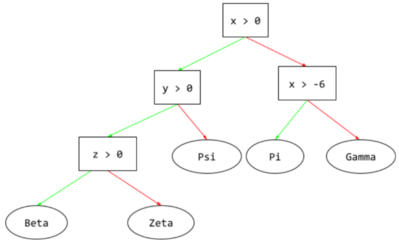
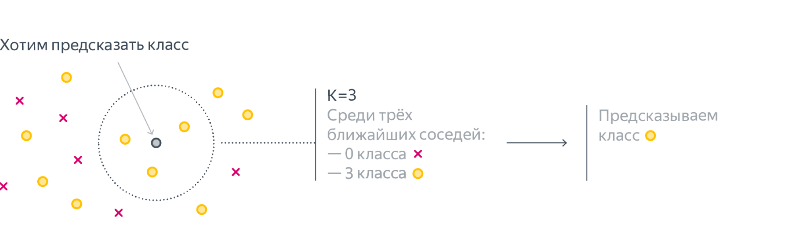
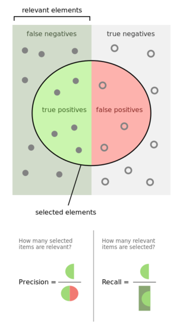

# [Классификаци](https://serokell.io/blog/machine-learning-algorithm-classification-overview) (предсказание категории объекта)

Порог принятия решения - это значение вероятности, при котором объект считается принадлежащим к первому классу.

## Наивный Байес
:   [<b>Наивный байесовский алгоритм</b>](https://serokell.io/blog/k-means-clustering-in-machine-learning) — это вероятностный алгоритм машинного обучения, основанный на применении теоремы Байеса и используемый в самых разных задачах классификации.

    <b>Теорема Байеса</b> — это простая математическая формула, используемая для вычисления условных вероятностей.

    Условная вероятность — это вероятность наступления одного события при условии, что другое событие уже произошло.

    $$
    P(A|B) = \frac{P(B|A) * P(A)}{P(B)}
    $$

    Она показывает, как часто происходит событие A при наступлении события B, обозначается как P(A|B) и имеет второе название «апостериорная вероятность».

    При этом мы должны знать:

    * Как часто происходит событие B при наступлении события A, что обозначается в формуле как P(B|A);
    * Какова вероятность того, что A не зависит от других событий, обозначаемая в формуле как P(A);
    * Какова вероятность того, что B не зависит от других событий. В формуле она обозначается как P(B).

    ### Почему наивный ?

    Давайте рассмотрим пример. Ниже представлен обучающий набор данных, содержащий один признак «Погодные условия» (weather) и целевую переменную «Игра» (play), которая обозначает возможность проведения матча. На основе погодных условий мы должны определить, состоится ли матч. Чтобы сделать это, необходимо выполнить следующие шаги.

    Шаг 1. Преобразуем набор данных в частотную таблицу (frequency table).

    Шаг 2. Создадим таблицу правдоподобия (likelihood table), рассчитав соответствующие вероятности. Например, вероятность облачной погоды (overcast) составляет 0,29, а вероятность того, что матч состоится (yes) – 0,64.

    Шаг 3. С помощью теоремы Байеса рассчитаем апостериорную вероятность для каждого класса при данных погодных условиях. Класс с наибольшей апостериорной вероятностью будет результатом прогноза.

    Задача. Состоится ли матч при солнечной погоде (sunny)? Мы можем решить эту задачу с помощью описанного выше подхода. P(Yes | Sunny) = P(Sunny | Yes) * P(Yes) / P(Sunny) Здесь мы имеем следующие значения: P(Sunny | Yes) = 3 / 9 = 0,33 P(Sunny) = 5 / 14 = 0,36 P(Yes) = 9 / 14 = 0,64 Теперь рассчитаем P(Yes | Sunny): P(Yes | Sunny) = 0,33 * 0,64 / 0,36 = 0,60 Значит, при солнечной погоде более вероятно, что матч состоится.

    !!! warning ""
        допущения наивного байесовского алгоритма, как правило, некорректны в реальных ситуациях. Допущение о независимости всегда некорректно, но часто хорошо работает на практике. Поэтому алгоритм и называется наивным.

    ??? note "Пример"
        Давайте рассмотрим пример. Ниже представлен обучающий набор данных, содержащий один признак «Погодные условия» (weather) и целевую переменную «Игра» (play), которая обозначает возможность проведения матча. На основе погодных условий мы должны определить, состоится ли матч. Чтобы сделать это, необходимо выполнить следующие шаги.

        Шаг 1. Преобразуем набор данных в частотную таблицу (frequency table).

        Шаг 2. Создадим таблицу правдоподобия (likelihood table), рассчитав соответствующие вероятности. Например, вероятность облачной погоды (overcast) составляет 0,29, а вероятность того, что матч состоится (yes) – 0,64.

        Шаг 3. С помощью теоремы Байеса рассчитаем апостериорную вероятность для каждого класса при данных погодных условиях. Класс с наибольшей апостериорной вероятностью будет результатом прогноза.

        Задача. Состоится ли матч при солнечной погоде (sunny)? Мы можем решить эту задачу с помощью описанного выше подхода. P(Yes | Sunny) = P(Sunny | Yes) * P(Yes) / P(Sunny) Здесь мы имеем следующие значения: P(Sunny | Yes) = 3 / 9 = 0,33 P(Sunny) = 5 / 14 = 0,36 P(Yes) = 9 / 14 = 0,64 Теперь рассчитаем P(Yes | Sunny): P(Yes | Sunny) = 0,33 * 0,64 / 0,36 = 0,60 Значит, при солнечной погоде более вероятно, что матч состоится.

        !!! danger ""
            Если в тестовом наборе данных присутствует некоторое значение категорийного признака, которое не встречалось в обучающем наборе данных, тогда модель присвоит нулевую вероятность этому значению и не сможет сделать прогноз. Это явление известно под названием «нулевая частота» (zero frequency). Данную проблему можно решить с помощью сглаживания. Одним из самых простых методов является сглаживание по Лапласу (Laplace smoothing).

## Деревья Решений

:   {align=left}

    Модель контролируемого обучения, состоящая из набора условий и листьев, организованных иерархически.

    Два самых популярных алгоритма построения деревьев:

??? note "CART"
    CART

??? note "C4.5"
    C4.5

 

## [K-ближайших соседей](https://serokell.io/blog/k-means-clustering-in-machine-learning)
:   Метод KNN (метод ближайших соседей) классифицирует объекты на основе их близости к соседям. Он определяет класс нового объекта, основываясь на классах его ближайших соседей по некоторой
    заданной метрике расстояния. Алгоритм не имеет формальной фазы обучения, что может привести к переобучению при использовании небольшого количества соседей. Это происходит из-за возможности алгоритма "запомнить" всю обучающую выборку и неэффективно обобщать на новые данные.

    

## Машины Опорных Векторов
:   SVM - это алгоритм машинного обучения с учителем, который выполняет задачи классификации или регрессии путем создания делителя, разделяющего данные на две категории. Оптимальным разделителем считается тот, который находится на равном расстоянии от границ каждой группы.
[статья](https://serokell.io/blog/k-means-clustering-in-machine-learning)

## Как оценить качество модели?

### Матрица ошибок (confusion matrix)

В машинном обучении используют термины "положительный класс" и "отрицательный класс". Положительный класс обычно представляет интересующий нас результат, который мы пытаемся выявить или предсказать, в то время как отрицательный класс - это результат, который не представляет для нас интереса или не является целью предсказания. Например, при задаче определения спама в электронной почте, спам может быть определен как положительный класс, а обычные письма как отрицательный класс.

Заметим, что для каждого объекта в выборке возможно 4 ситуации:

* мы предсказали положительную метку и угадали. Будет относить такие объекты к true positive (TP) группе (true – потому что предсказали мы правильно, а positive – потому что предсказали положительную метку);
* мы предсказали положительную метку, но ошиблись в своём предсказании – false positive (FP) (false, потому что предсказание было неправильным);
* мы предсказали отрицательную метку и угадали – true negative (TN);
* и наконец, мы предсказали отрицательную метку, но ошиблись – false negative (FN).

Для удобства все эти 4 числа изображают в виде таблицы, которую называют confusion matrix (матрицей ошибок)

### Метрики качества

#### Accuracy

accuracy — доля правильных ответов алгоритма:

$$
Accuracy = \frac{TP + TN}{TP + TN + FP + FN}
$$

Эта метрика бесполезна в задачах с неравными классами

Допустим, мы хотим оценить работу спам-фильтра почты. У нас есть 100 не-спам писем, 90 из которых наш классификатор определил верно (True Negative = 90, False Positive = 10), и 10 спам-писем, 5 из которых классификатор также определил верно (True Positive = 5, False Negative = 5). Тогда accuracy:

$$
Accuracy = \frac{5 + 90}{5 + 90 + 10 + 5} = 86.4
$$

Однако если мы просто будем предсказывать все письма как не-спам, то получим более высокую accuracy:

$$
Accuracy = \frac{0 + 100}{0 + 100 + 0 + 10} = 90.9
$$

При этом, наша модель совершенно не обладает никакой предсказательной силой, так как изначально мы хотели определять письма со спамом. Преодолеть это нам поможет переход с общей для всех классов метрики к отдельным показателям качества классов.

#### Error rate

Error rate - Это мера, обратная к accuracy. Error rate представляет собой долю ошибок в прогнозах модели относительно общего числа прогнозов. То есть это процент ошибок: чем меньше error rate, тем лучше модель.

$$
Error Rate = \frac{FP + FN}{TP + TN + FP + FN}
$$

#### Precision

Precision можно интерпретировать как долю объектов, названных классификатором положительными и при этом действительно являющимися положительными

$$
Precision = \frac{TP}{TP + FP}
$$

#### Recall 
показывает, какую долю объектов положительного класса из всех объектов положительного класса нашел алгоритм.

$$
recall = \frac{TP}{TP + FN}
$$

??? info "Отличие recall от Precision"
    Recall демонстрирует способность алгоритма обнаруживать данный класс вообще, а precision — способность отличать этот класс от других классов.
    

#### F1-measure

F-мера (F-measure) - это метрика оценки качества моделей в машинном обучении, которая объединяет precision (точность) и recall (полноту) в одно числовое значение. Это гармоническое среднее между точностью и полнотой и используется для оценки моделей, особенно в задачах, где необходимо найти баланс между обнаружением всех объектов класса (полнота) и избежанием ложных срабатываний (точность). F-мера вычисляется по формуле: \( F = 2 \times \frac{{\text{precision} \times \text{recall}}}{{\text{precision} + \text{recall}}} \)

$$
F = \frac{TP}{TP + \frac{FP + FN}{2}}
$$

#### ROC-кривая

Когда мы пытаемся уловить больше положительных случаев, мы начинаем ошибаться, считая некоторые отрицательные как положительные. 

TPR (true positive rate) - говорит о том, как много положительных мы правильно определили среди всех реальных положительных случаев.

$$
TPR = \frac{TP}{TP + FN}
$$

FPR (false positive rate) - показывает, как много отрицательных случаев мы ошибочно определили как положительные.

$$
FPR = \frac{FP}{FP + TN}
$$

Эти две метрики помогают понять, насколько точно мы находим положительные случаи, и сколько ошибок мы допускаем, считая отрицательные случаи положительными.

Однако обе эти величины растут при уменьшении порога. Кривая в осях TPR/FPR, которая получается при варьировании порога, исторически называется ROC-кривой (receiver operating characteristics curve, сокращённо ROC curve)

ROC-кривая - это график, который показывает, насколько хорошо модель машинного обучения может классифицировать объекты по двум классам. Она строится на основе двух метрик: FPR и TPR

ROC-кривая показывает, как меняется чувствительность модели при изменении её порога принятия решения.
 
Например, если порог принятия решения равен 0,5, то модель считает, что объект принадлежит к первому классу, если вероятность его принадлежности к этому классу больше или равна 0,5.

Если порог принятия решения равен 1, то модель считает, что объект принадлежит к первому классу, если вероятность его принадлежности к этому классу равна 1.

ROC-кривая всегда начинается в точке (0,0) и заканчивается в точке (1,1). Идеальная модель имеет ROC-кривую, которая проходит через точку (1,1). Это означает, что модель правильно классифицирует все объекты обоих классов.

Чем лучше классификатор разделяет два класса, тем больше площадь (area under curve) под ROC-кривой – и мы можем использовать её в качестве метрики. Эта метрика называется AUC.

#### AUC (Area Under the Curve) / площадь под кривой ROC

AUC (Area Under the Curve) — это метрика, используемая для оценки качества моделей машинного обучения при решении задач классификации. Она измеряет площадь под кривой ROC (Receiver Operating Characteristic), которая отображает отношение между чувствительностью (вероятность правильной классификации положительного класса) и специфичностью (вероятность правильной классификации отрицательного класса) модели при изменении порогового значения.

Чем ближе значение AUC к 1, тем лучше модель способна разделять классы. Значение AUC 0.5 указывает на случайное угадывание классов, а значение менее 0.5 — на то, что модель хуже, чем случайное угадывание.