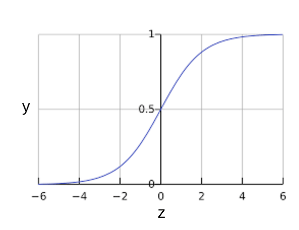

# Регрессия

Линейная - когда регрессия рисует прямую линию

Полиномиальная - когда регрессия рисует кривую линию

## Линейная регрессия

:   Линейная регрессия - это метод нахождения прямой линии или гиперплоскости, которая наилучшим образом соответствует набору точек

    

    Так выглядит простая линейная регрессия
    $$
      y = b + w_{1}x_{1}
    $$
    где:

    * y — прогнозируемая метка (желаемый результат).
    * b - это смещение(biases) (пересечение оси Y), иногда называемое w0.
    * w — вес признака 1. Вес — это то же понятие, что и «наклон» в линейном уравнение в математике y = kx + b.
    * x - это признак (вход).

    ??? info "Что такое bias"
        Bias - это параметр в моделях машинного обучения.
        В простой двумерной линии bias означает просто смещение линии.
        Например, смещение линии на следующем рисунке равно 2. Смещение существует потому, что не все модели начинаются из начала координат (0,0).
        Например, предположим, что вход в парк аттракционов стоит 2 евро и еще 0,5 евро за каждый час пребывания посетителя. Таким образом, модель, отображающая общую стоимость, имеет погрешность 2, поскольку наименьшая стоимость составляет 2 евро.
        

    Хотя эта модель использует только одну фичу, более сложная модель может иметь несколько фич, каждая из которых имеет отдельный вес (w1, w2 и т. д.). Например, более сложная модель, основанная на несколько фич, может выглядеть следующим образом:

    $$
      y = b + w_{1}x_{1} + w_{2}x_{2} + w_{3}x_{3} + ... + w_{n}x_{n}
    $$

    ### Функция потерь / Loss function

    <a><b>потеря(loss)</a></b> — это число, показывающее, насколько плохим был прогноз модели на отдельном примере

    

    <a><b>Функция потерь</a></b> - это количественная оценка того, насколько хорошо модель предсказывает целевую переменную. Эти функции показывают, насколько сильно предсказанный моделью результат отличается от фактического.

    ??? info "Среднеквадратическая ошибка (MSE) / L2 loss"

        Это сумма квадратов разностей между предсказанными и истинными значениями, деленная на количество объектов

        ```py linenums="1" title="MSE на Python"
        import numpy as np # импортируем библиотеку numpy
        def mean_squared_error(act, pred): # функция 

          diff = pred - act # находим разницу между прогнозируемыми и наблюдаемыми значениями
          differences_squared = diff ** 2 # возводим в квадрат (чтобы избавиться от отрицательных значений)
          mean_diff = differences_squared.mean() # находим среднее значение
          
          return mean_diff

        act = np.array([1.1,2,1.7]) # создаем список актуальных значений
        pred = np.array([1,1.7,1.5]) # список прогнозируемых значений

        print(mean_squared_error(act,pred))

        #Вывод:
        #0.04666666666666667
        ```

    ??? info "Корень среднеквадратической ошибки (RMSE) / L2 loss"

        Квадратный корень из средней квадратичной ошибки.

        ```py linenums="1" title="RMSE на Python"
        import numpy as np
        def root_mean_squared_error(act, pred):

          diff = pred - act # находим разницу между прогнозируемыми и наблюдаемыми значениями
          differences_squared = diff ** 2 # возводим в квадрат
          mean_diff = differences_squared.mean() # находим среднее значение
          rmse_val = np.sqrt(mean_diff) # извлекаем квадратный корень
          return rmse_val

        act = np.array([1.1,2,1.7])
        pred = np.array([1,1.7,1.5])

        print(root_mean_squared_error(act,pred))

        #Вывод:
        #0.21602468994692867
        ```

    ??? info "Средняя абсолютная ошибка (MAE) / L1 loss"

        Средняя абсолютная ошибка (MAE) рассчитывается как среднее значение абсолютной разницы между прогнозами и фактическими наблюдениями.

        ```py linenums="1" title="MAE на Python"
        import numpy as np 
        def mean_absolute_error(act, pred): #
            diff = pred - act # находим разницу между прогнозируемыми и наблюдаемыми значениями
            abs_diff = np.absolute(diff) #находим абсолютную разность между прогнозами и фактическими наблюдениями
            mean_diff = abs_diff.mean() # находим среднее значение
            return mean_diff

        act = np.array([1.1,2,1.7])
        pred = np.array([1,1.7,1.5])
        mean_absolute_error(act,pred)

        #Вывод:
        #0.20000000000000004
        ```

    ### Как мы уменьшаем потери?

    #### Гиперпараметры

    :   [<b>Гиперпараметры</b>](https://serokell.io/blog/ml-optimization) — это настройки модели, которые определяют её общую структуру и способ обучения. Эти параметры устанавливаются
        до начала процесса обучения и не изменяются в процессе обучения модели. Гиперпараметры оказывают влияние на то, как модель будет обучаться, какие признаки будут учитываться, и какие ограничения будут наложены на процесс обучения. Примерами гиперпараметров могут быть количество слоев и нейронов в нейронной сети, скорость обучения, learning rate для градиентного спуска, коэффициент регуляризации и т.д.

        ??? info "Отличие от параметров"
            Различие между гиперпараметрами и параметрами модели заключается в том, что гиперпараметры задаются вручную до начала обучения и определяют характеристики всего процесса обучения, в то время как параметры модели вычисляются в процессе обучения на основе данных и оптимизируются для достижения наилучшей производительности. Гиперпараметры можно сравнить с настройками инструмента, с помощью которого вы создаете модель, а параметры модели - это результат работы этого инструмента на конкретных данных
        
        ??? info "Поиск гиперпараметров"
            Выбор подходящих гиперпараметров — это чрезвычайно важный этап в создании моделей машинного обучения. Неправильный выбор гиперпараметров может привести к неудовлетворительным результатам, долгим сессиям обучения и переобучению.

            ??? info "Решетчатый поиск (Grid Search)"
                Этот метод предполагает набор значений для каждого гиперпараметра, которые затем перебираются для нахождения наилучшей комбинации. Для каждой комбинации гиперпараметров производится обучение модели и оценка её производительности на валидационных данных.

                Примеры:

                * Для метода ближайших соседей можно, например, перебирать по сетке число соседей (например, от 1 до 20) и метрику, по которой будет измеряться расстояние между объектами выборки (евклидова, манхэттенская...);
                * Для решающих деревьев можно перебирать по сетке сочетания значений максимальной глубины дерева и различные критерии ветвления (критерий Джини, энтропийный критерий).

                ```py linenums="1" title="Пример кода на Python:"
                from sklearn.model_selection import GridSearchCV
                from sklearn.ensemble import RandomForestClassifier

                # Определение параметров и их значений для перебора
                param_grid = {
                    'n_estimators': [50, 100, 150],
                    'max_depth': [None, 10, 20],
                    'min_samples_leaf': [1, 2, 4]
                }

                # Создание модели и настройка с использованием решетчатого поиска
                rf_model = RandomForestClassifier()
                grid_search = GridSearchCV(rf_model, param_grid, cv=5)
                grid_search.fit(X_train, y_train)

                # Вывод наилучших гиперпараметров и оценки
                print("Best Hyperparameters:", grid_search.best_params_)
                print("Best Cross-Validation Score:", grid_search.best_score_)
                ```

                Так как этот метод гарантирует полный перебор всех заданных комбинаций гиперпараметров. Однако это может быть очень ресурсозатратным, особенно при большом числе гиперпараметров и значений.

            ??? info "Случайный поиск (Random Search)"
                Вместо того чтобы перебирать все комбинации, случайный поиск выбирает случайные наборы значений для каждого гиперпараметра.

                ```py linenums="1" title="Пример кода на Python:"
                from sklearn.model_selection import RandomizedSearchCV
                from sklearn.ensemble import RandomForestClassifier
                from scipy.stats import randint

                # Определение диапазонов значений для случайного поиска
                param_dist = {
                    'n_estimators': randint(50, 200),
                    'max_depth': [None, 10, 20, 30, 40, 50],
                    'min_samples_leaf': [1, 2, 4]
                }

                # Создание модели и настройка с использованием случайного поиска
                rf_model = RandomForestClassifier()
                random_search = RandomizedSearchCV(rf_model, param_distributions=param_dist, n_iter=100, cv=5)
                random_search.fit(X_train, y_train)

                # Вывод наилучших гиперпараметров и оценки
                print("Best Hyperparameters:", random_search.best_params_)
                print("Best Cross-Validation Score:", random_search.best_score_)
                ```

                Случайный поиск может быть эффективнее в поиске оптимальных гиперпараметров, особенно когда ресурсы ограничены. Однако есть вероятность упустить некоторые комбинации, которые могли бы быть лучшими.

                В машинном обучении часто используются понятия "exploration" и "exploitation". Давайте представим, что вы выбираете ресторан. Если вы всегда ходите в одно место, где уверены в качестве еды, вы мало исследуете другие варианты. Однако, если каждый раз ходить в новые места, результат может быть неудовлетворительным.

                Аналогично в методах подбора параметров в машинном обучении происходит балансировка между исследованием новых областей (exploration) и использованием уже известных, эффективных решений (exploitation). Основное отличие методов которые будут далее от Grid Search учитывают предыдущие результаты, выбирая новые точки для изучения таким образом, чтобы либо расширять зону поиска, либо углубляться в уже известные, наилучшие варианты.


    #### Градиентные спуск / gradient descent

    :   Градиентный спуск - это метод оптимизации основан на отрицательных градиентах для нахождения минимального значения функции потерь.
        Минимизация любой функции означает поиск минимума функции(самой глубокой впадины).
        Поиск минимума нужен для получения наименьшей возможной ошибки или повышение точности модели.
        Мы увеличиваем точность, перебирая набор учебных данных при настройке параметров нашей модели (весов и смещений).

        Суть алгоритма – процесс получения наименьшего значения ошибки. Аналогично это можно рассматривать как спуск во впадину в попытке найти золото на дне ущелья (самое низкое значение ошибки).

        

        Градиентный спуск работает, вычисляя градиенты каждого параметра функции(для всех weight и bias). Затем он уменьшает на очень малую величину параметры согласно отрицательному градиенту и смотрит насколько изменится значение функции потерь. Этот процесс повторяется до тех пор, пока функция потерь не достигнет минимального значения.

        ??? info "Градиент это"
            Градиент f(x, y) — это двумерный вектор, который сообщает вам, в каком направлении (x, y) двигаться для максимального увеличения высоты. Таким образом, отрицательный градиент перемещает вас в сторону максимального уменьшения высоты. Другими словами, отрицательный вектор градиента указывает в долину.

        В машинном обучении градиенты используются при градиентном спуске. У нас часто есть функция потерь многих переменных, которую мы пытаемся минимизировать, и мы пытаемся сделать это, следуя отрицательному градиенту функции.

        Градиентный спуск имеет несколько параметров, которые могут быть настроены для улучшения его эффективности:

        * <b>Скорость обучения (learning rate) или шаг:</b> это параметр, который контролирует размер шага градиентного спуска. Если коэффициент скорости обучения слишком большой, градиентный спуск может перепрыгнуть через минимум функции потерь. Если коэффициент скорости обучения слишком маленький, градиентный спуск будет слишком медленным. Алгоритмы градиентного спуска умножают градиент на learning rate, чтобы определить следующую точку. Например, если величина градиента равна 2,5, а скорость обучения равна 0,01, то алгоритм градиентного спуска выберет следующую точку на расстоянии 0,025 от предыдущей точки.

        ##### Типы градиентного спуска

        Существует несколько типов градиентного спуска:

        * <b>Стохастический градиентный спуск</b> - Алгоритм градиентного спуска, в котором размер батча равен единице. Другими словами, SGD обучается на одном примере, выбранном случайным образом из обучающего множества(train set).
        * <b>Mini-batch stochastic gradient descent</b> - это самый простой тип градиентного спуска. Он вычисляет градиент функции потерь для каждого примера обучения и делает шаг в этом направлении.

## Логистическая регрессия

Логистическая регрессия генерирует вероятность — значение от 0 до 1, исключающее. Например, рассмотрим модель логистической регрессии для обнаружения спама. Если модель выводит значение 0,932 для конкретного сообщения электронной почты, это означает, что вероятность того, что сообщение электронной почты является спамом, составляет 93,2 %.

Как модель логистической регрессии может гарантировать, что выходные данные всегда находятся в диапазоне от 0 до 1. Как оказалось, сигмоидальная функция, определенная следующим образом, выдает выходные данные с теми же характеристиками:

$$
y = \frac{1}{1 + e^-z }
$$

где:

* y – выходные данные модели логистической регрессии для конкретного примера.
* z = b + w1x1 + w2x2 + … wnxn
    * Тем w values — это изученные весовые коэффициенты модели, и b является предвзятостью.
    * Тем x values — это значения признаков для конкретного примера.

Сигмоидальная функция дает следующий график:



Обратите внимание, что также называется логарифмическими шансами, потому что обратная сигмовидная величина гласит, что может быть определен как логарифм вероятности (например, «Собака лает»), деленная на вероятность (например, «Собака не лает»):

$$
z = log(\frac{y}{1 - y})
$$

??? info "Пример"
    Предположим, у нас есть модель логистической регрессии с тремя функциями, которая изучила следующие смещения и веса:
    $$
    b = 1
    $$
    $$
    w_{1} = 2
    $$
    $$
    w_{2} = -1
    $$
    $$
    w_{3} = 5
    $$
    Далее предположим следующие значения признаков для данного примера:
    $$
    x_{1} = 0
    $$
    $$
    x_{2} = 10
    $$
    $$
    x_{3} = 2
    $$
    Таким образом, логарифмические шансы:
    $$
    b + w_{1}x_{1} + w_{2}x_{2} + w_{3}x_{3}
    $$
    будет:
    $$
    1 + 2 * 0 + (-1) * 10 + 5 * 2 = 1
    $$
    Следовательно, прогноз логистической регрессии для этого конкретного примера будет равен 0,731:
    $$
    y = \frac{1}{1 + e^-1} = 0.731
    $$
    вероятность 73,1%.

### Функция потерь

Log Loss - функция потерь для логистической регрессии