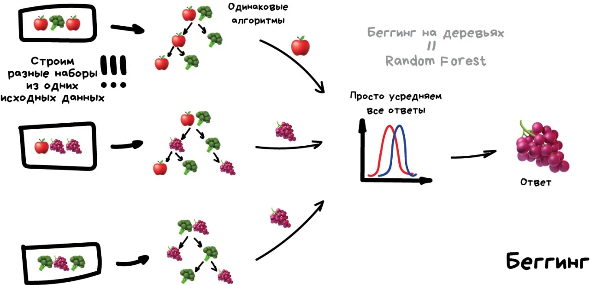

# Беггинг
Он же Bootstrap AGGregatING. Обучаем один алгоритм много раз на случайных выборках из исходных данных. В самом конце усредняем ответы.
Данные в случайных выборках могут повторяться. То есть из набора 1-2-3 мы можем делать выборки 2-2-3, 1-2-2, 3-1-2 и так пока не надоест. На них мы обучаем один и тот же алгоритм несколько раз, а в конце вычисляем ответ простым голосованием.

{align=left width=400}

Самый популярный пример беггинга — алгоритм Random Forest, беггинг на деревьях, который и нарисован на картинке. Когда вы открываете камеру на телефоне и видите как она очертила лица людей в кадре желтыми прямоугольниками — скорее всего это их работа. Нейросеть будет слишком медлительна в реальном времени, а беггинг идеален, ведь он может считать свои деревья параллельно на всех шейдерах видеокарты.
Дикая способность параллелиться даёт беггингу преимущество даже над следующим методом, который работает точнее, но только в один поток. Хотя можно разбить на сегменты, запустить несколько… ах кого я учу, сами не маленькие.

## [Random Fores](https://serokell.io/blog/random-forest-classification)

Random Forest - это метод, который объединяет много деревьев для принятия решений. Это помогает избежать переобучения и повысить точность по сравнению с одним деревом. Он получает прогноз, объединяя ответы этих деревьев, которые обучаются независимо друг от друга на разных частях данных.

Большое количество деревьев с глубокими уровнями подходит для бэггинга, когда мы хотим определить класс по голосованию. Например, если 100 деревьев указывают на нулевой класс, а 400 на первый, модель предсказывает первый класс. В задачах регрессии используется среднее значение всех деревьев.

Random Forest требует много ресурсов из-за глубоких деревьев. Увеличение их глубины может улучшить точность, но может привести к переобучению. Важно находить баланс, подбирая оптимальные гиперпараметры.