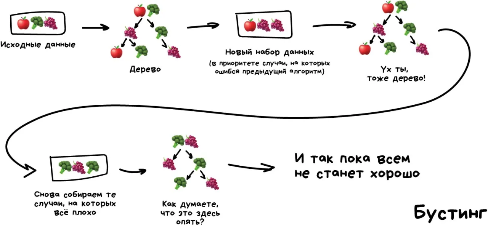

# Бустинг

{align=left width=400}

Обучаем алгоритмы последовательно, каждый следующий уделяет особое внимание тем случаям, на которых ошибся предыдущий.
Как в беггинге, мы делаем выборки из исходных данных, но теперь не совсем случайно. В каждую новую выборку мы берём часть тех данных, на которых предыдущий алгоритм отработал неправильно. То есть как бы доучиваем новый алгоритм на ошибках предыдущего.

Плюсы — неистовая, даже нелегальная в некоторых странах, точность классификации, которой позавидуют все бабушки у подъезда. Минусы уже названы — не параллелится. Хотя всё равно работает быстрее нейросетей, которые как гружёные камазы с песком по сравнению с шустрым бустингом.
Нужен реальный пример работы бустинга — откройте Яндекс и введите запрос. Слышите, как Матрикснет грохочет деревьями и ранжирует вам результаты? Вот это как раз оно, Яндекс сейчас весь на бустинге. Про Google не знаю.

## Градиентный бустинг
градиентным бустингом над решающими деревьями, Gradient Boosting on Decision Trees, GBDT

Градиентный бустинг - это метод машинного обучения, в котором модель создается из нескольких простых моделей, обычно деревьев решений. Они добавляются поочередно, чтобы каждая новая модель исправляла ошибки предыдущей. Это подобно решению последовательности математических задач, где каждая модель пытается исправить ошибки предшествующей, приближаясь к точному предсказанию целевого значения.

Название "градиентный бустинг" происходит от принципа работы этого метода, который использует градиентный спуск для минимизации ошибки модели. В процессе обучения каждое последующее дерево (или любая другая базовая модель) настраивается на остатки, оставшиеся после предыдущих моделей, используя градиентные методы оптимизации для поиска наилучших параметров, способных минимизировать ошибку прогнозирования.

## CatBoost
## Light GBM
## XGBoost