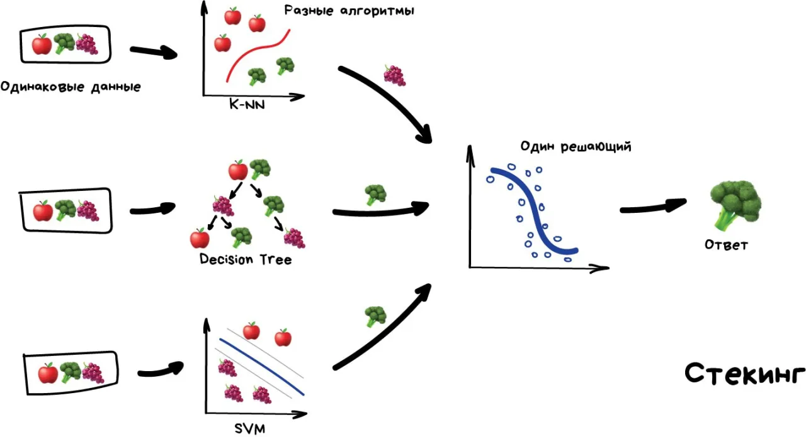

# Ансамбль моделей

{align=left width=400}

Идея применения ансамблей в машинном обучение настолько точна и эффективна, что сегодня её используются все крупные компани в продакшене

Оказывается, если взять несколько не очень эффективных методов обучения и обучить исправлять ошибки друг друга, качество такой системы будет аж сильно выше, чем каждого из методов по отдельности.

Причём даже лучше, когда взятые алгоритмы максимально нестабильны и сильно плавают от входных данных. Поэтому чаще берут Регрессию и Деревья Решений, которым достаточно одной сильной аномалии в данных, чтобы поехала вся модель. 
А вот Байеса и K-NN не берут никогда — они хоть и тупые, но очень стабильные.

Ансамбль можно собрать как угодно, хоть случайно нарезать в тазик классификаторы и залить регрессией. За точность, правда, тогда никто не ручается. 

Потому есть три проверенных способа делать ансамбли.

Обучаем несколько разных алгоритмов и передаём их результаты на вход последнему, который принимает итоговое решение.

Ключевое слово — разных алгоритмов, ведь один и тот же алгоритм, обученный на одних и тех же данных не имеет смысла. Каких — ваше дело, разве что в качестве решающего алгоритма чаще берут регрессию.
Чисто из опыта — стекинг на практике применяется редко, потому что два других метода обычно точнее.