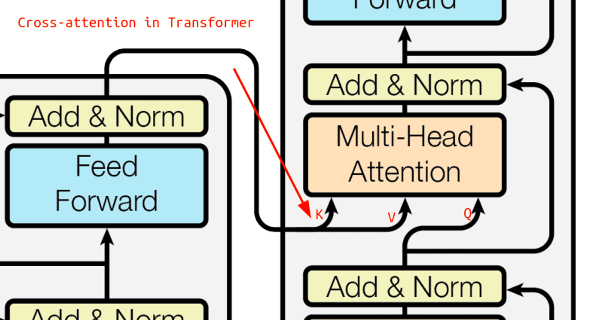
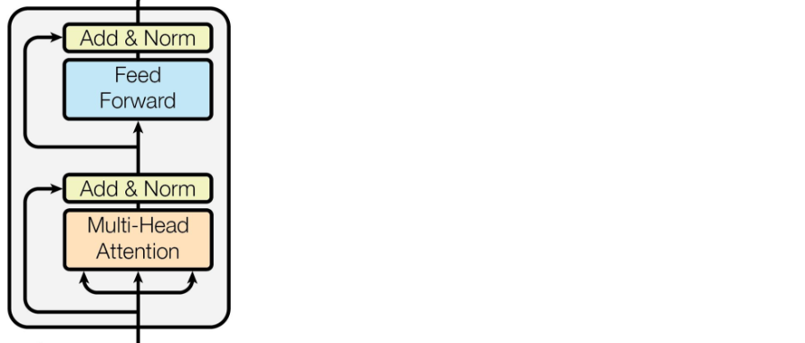

# Attention

позволяет модели сосредотачиваться на определенных частях данных или аспектах входной информации.

В этой модели энкодер кодирует исходное предложение в последовательность скрытых состояний. Декодер генерирует перевод, используя эти скрытые состояния.

На каждом шаге декодер вычисляет attention score для каждого токена исходного предложения. Attention score показывает, насколько важен данный токен для генерации текущего токена перевода.

Затем attention scores преобразуются в attention distribution, используя функцию softmax. Attention distribution показывает, насколько вероятно, что каждый токен исходного предложения важен для генерации текущего токена перевода.

Наконец, attention distribution используется для вычисления окончательного вектора внимания. Этот вектор представляет собой взвешенную сумму скрытых состояний всех токенов исходного предложения.

Вектор внимания добавляется к скрытому состоянию декодера, что позволяет декодеру учитывать важность всех токенов исходного предложения.

## Какие бывают виды механизмов внимания?

Существует много разных видов механизмов внимания. Наиболее распространенными являются следующие:

* Базовый dot-product: attention score вычисляется как скалярное произведение скрытого состояния декодера и скрытого состояния энкодера.
* Мультипликативный: attention score вычисляется как произведение скрытого состояния декодера и скрытого состояния энкодера.
* MLP: attention score вычисляется с помощью многослойного перцептрона.

## Self-Attention

Self-attention (механизм внутреннего внимания) используется для анализа взаимосвязей между элементами последовательности и создания репрезентации контекста для каждого элемента на основе других элементов в этой же последовательности.

Принцип self-attention состоит в том, что для каждого элемента в последовательности (например, для каждого слова в предложении) создаются три вектора: Query (запрос), Key (ключ) и Value (значение). Эти векторы формируются путем умножения входного вектора слов на соответствующие матрицы весов.

- **Query (запрос)** - вектор, который определяет направление внимания к другим токенам.
- **Key (ключ)** - вектор, который указывает на возможные цели внимания (каким токенам следует уделить внимание).
- **Value (значение)** - вектор, содержащий смысловую информацию токена.

Далее для каждого элемента в последовательности вычисляется взаимосвязь (важность) с другими элементами путем скалярного произведения Query и Key векторов. Полученные числа нормализуются через softmax для получения распределения важности. Затем Value векторы умножаются на эти веса и складываются, формируя контекстную репрезентацию элемента на основе важности других элементов в последовательности. Это дает возможность модели учитывать контекст при обработке каждого элемента.

??? info "Пример"
    Формула для вычисления self-attention в рамках механизма внимания Transformer выглядит следующим образом:

    Пусть у нас есть последовательность входных векторов (эмбеддингов) \(\textbf{X} = [x_1, x_2, ..., x_n]\), где \(n\) - количество токенов или элементов в последовательности.

    Для каждого элемента \(x_i\) генерируются Query (\(Q_i\)), Key (\(K_i\)) и Value (\(V_i\)) векторы. Предполагается, что мы имеем матрицы весов \(W^Q\), \(W^K\) и \(W^V\) для преобразования входных векторов в Query, Key и Value вектора соответственно.

    Затем выполняются следующие шаги для получения self-attention выхода для каждого элемента \(x_i\):

    1. Вычисление Query (\(Q_i\)), Key (\(K_i\)) и Value (\(V_i\)) векторов:
    \(Q_i = X \cdot W^Q_i\)
    \(K_i = X \cdot W^K_i\)
    \(V_i = X \cdot W^V_i\)

    2. Вычисление скалярного произведения Query и Key векторов с последующей нормализацией через софтмакс:
    \(A_i = \text{softmax}\left(\frac{Q_i \cdot K_i^\top}{\sqrt{d_k}}\right)\)

    где \(d_k\) - размерность Query и Key векторов.

    3. Умножение нормализованных весов (A) на Value (\(V\)) векторы:
    \(Z_i = A_i \cdot V_i\)

    4. Объединение результатов взвешенных Value (\(Z\)) векторов:
    \(Z = [Z_1, Z_2, ..., Z_n]\)

    Это описание применяется для одного head self-attention. В случае multi-head self-attention, каждая голова будет использовать свои матрицы весов и производить аналогичные операции, после чего результаты конкатенируются и умножаются на дополнительную матрицу весов для получения итогового представления.

Важным улучшением является механизм multi-head self-attention, который позволяет параллельно выполнять несколько self-attention операций с разными матрицами весов. Результаты этих операций конкатенируются и проходят через дополнительный слой для объединения информации из различных аспектов взаимосвязей между элементами.

Self-attention позволяет моделировать внутренние зависимости и взаимодействия между элементами последовательности, что обеспечивает более глубокое понимание контекста при обработке текста.

## Transformers

Архитектура Transformer состоит из двух основных частей: энкодера и декодера. Энкодер и декодер включают в себя несколько повторяющихся блоков, каждый из которых содержит слои multi-head attention и feed-forward neural network.

Первая часть transformer-блока — это слой self-attention. Процесс self-attention начинается с создания трех матриц запросов, ключей и значений: \(W_Q,\ W_K,\ W_V\). Каждый элемент исходной последовательности умножается на эти матрицы, формируя соответствующие векторы запросов, ключей и значений. Далее, вычисляются веса внимания для каждого элемента путем вычисления скалярного произведения между векторами запросов и ключей. Эти веса проходят через функцию softmax для получения коэффициентов внимания, которые затем умножаются на соответствующие векторы значений. Результатом работы слоя self-attention является взвешенная сумма значений, что и составляет его выход.

Важно отметить, что в декодере Transformer используется слой кросс-внимания (cross-attention), в котором запросы берутся из выходной последовательности, а ключи и значения - из входной, то есть из результатов работы энкодера.

Внутри каждого блока энкодера присутствуют два основных слоя: multi-head attention и полносвязная нейронная сеть (feed-forward):

Multi-head attention - вместо одного слоя внимания применяются несколько параллельных с различными весами, а затем обьединяем результаты.

feed-forward network (FFN) - применяемcый к каждому элементу входной последовательности. Этот этап обработки может занимать значительное время в больших моделях или на коротких последовательностях.

После этих слоев к выходу добавляется вход (это называется residual connection), а затем применяется слой layer normalization для нормализации активаций на рисунке эта часть обозначена как «Add & Norm».

Все эти компоненты - self-attention, multi-head attention, feed-forward network, позиционные эмбеддинги - совместно образуют архитектуру Transformer.