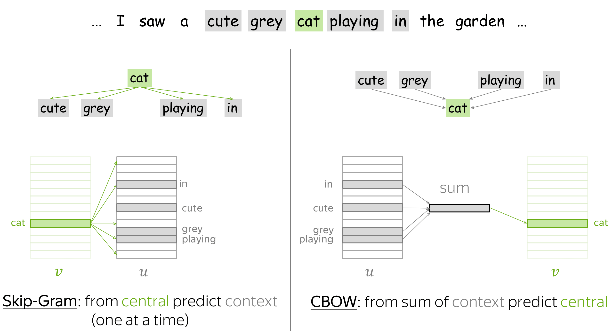

# Предобработка текста в NLP

Токенизация: Это процесс разделения текста на отдельные единицы, такие как слова или символы. Наиболее распространенным методом является разделение текста на слова. Это может быть выполнено с помощью стандартных функций разделения в Python или с использованием библиотеки NLTK.

Лемматизация: Это процесс приведения слов к их базовой или словарной форме (лемме). Например, слова "бегу", "бежал", "бегали" будут преобразованы к базовой форме "бежать". Лемматизация учитывает грамматические характеристики слова и обычно использует словари или знание о конкретном языке. Библиотеки, такие как NLTK или spaCy, предоставляют инструменты для лемматизации.

Стемминг: Это процесс обрезания слов до их основы или корня. Он менее сложен, чем лемматизация, и обычно работает путем отсечения суффиксов или окончаний слова. Однако стемминг может порождать не всегда корректные или реальные слова. Например, "бежал" и "бежит" могут быть обрезаны до "беж". NLTK предоставляет стеммеры для выполнения стемминга.

Удаление стоп-слов: Стоп-слова представляют собой часто встречающиеся слова, которые не приносят много смысла для анализа, например, предлоги, союзы и междометия. Удаление стоп-слов может помочь снизить шум и улучшить производительность модели. NLTK и другие библиотеки предоставляют списки стоп-слов для различных языков.

https://lena-voita.github.io/nlp_course/word_embeddings.html

На практике у вас есть словарь разрешенных слов, который вы выбираете заранее. Для каждого слова в словаре есть таблица поиска, содержащая его embedding. Это embedding можно найти по индексу слова в словаре (т. е. вы ищете embedding в таблице по индексу слова).

## One-hot Vectors

Мы можем представить слова как векторы, где каждое слово из словаря имеет свой уникальный вектор. Этот вектор содержит 1 если слово находится в словаре и 0 если нет.

## Count-Based Methods

### Co-Occurence Counts

Самый простой подход - определить контексты как каждое слово в окне размером L. Элемент матрицы для пары слово-контекст (w, c) - это количество раз, когда w встречается в контексте c. Это самый базовый (и очень, очень старый) метод получения вкраплений.

### Positive Pointwise Mutual Information (PPMI)

Здесь контексты определяются так же, как и раньше, но мера связи между словом и контекстом более умная: положительный PMI (или сокращенно PPMI). Мера PPMI широко рассматривается как современная для донейронных моделей распределения-подобия.

$$
PPMI(w, c) = max(0, PMI(w, c))
$$

где:

$$
PMI(w, c) = log \frac{N(w, c)|(w, c)|}{N(w)N(c)}
$$

### Latent Semantic Analysis (LSA)

Латентно-семантический анализ (LSA) анализирует коллекцию документов. Если в предыдущих подходах контексты служили только для получения векторов слов и затем отбрасывались, то здесь нас также интересует контекст, или, в данном случае, векторы документов. LSA - одна из простейших тематических моделей: для измерения сходства между документами можно использовать косинусоидальное сходство между векторами документов.

## Word2Vec

Word2Vec - это модель, параметрами которой являются векторы слов. Эти параметры итеративно оптимизируются для достижения определенной цели. Цель заставляет векторы слов "знать" контексты, в которых может встречаться слово: векторы обучаются предсказывать возможные контексты соответствующих слов. Как вы помните из гипотезы распределения, если векторы "знают" о контекстах, то они "знают" и значение слова.

Word2Vec - это итерационный метод. Его основная идея заключается в следующем:

берем огромный корпус текстов;
пройтись по тексту с помощью скользящего окна, перемещаясь по одному слову за раз. На каждом шаге есть центральное слово и контекстные слова (другие слова в этом окне);
для центрального слова вычислите вероятности контекстных слов;
скорректируйте векторы, чтобы увеличить эти вероятности.

### Skip-Gram

Skip-Gram - это модель, которую мы рассматривали до сих пор: она предсказывает контекстные слова по центральному слову.

### CBOW

CBOW (Continuous Bag-of-Words) предсказывает центральное слово по сумме векторов контекста. Эта простая сумма векторов слов называется "мешком слов", что и дало название модели.

