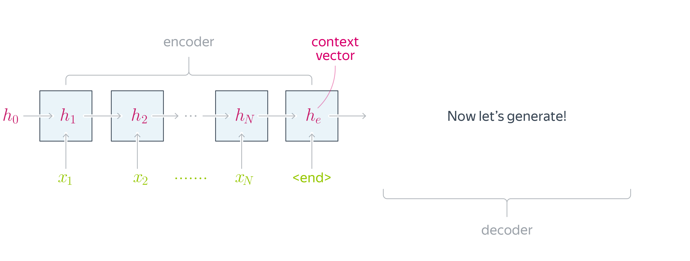

# Sequence-to-sequence

Seq2seq, это архитектура модели глубокого обучения, предназначенная для обработки последовательностей произвольной длины и создания соответствующих последовательностей на выходе. Эта модель состоит из двух основных компонентов: энкодера и декодера.

1. **Энкодер**:
   - Читает входную последовательность токен за токеном.
   - Применяет рекуррентные сети (например, LSTM) для обработки каждого токена и генерации скрытого состояния.
   - Последнее скрытое состояние (или контекстный вектор) энкодера содержит информацию о всей входной последовательности.

2. **Декодер**:
   - Получает контекстный вектор от энкодера и начинает генерацию выходной последовательности.
   - Использует рекуррентные сети для предсказания следующего токена в выходной последовательности.
   - На каждом шаге декодер учитывает предыдущие токены и информацию от энкодера для генерации следующего токена.
   - Работает до тех пор, пока не будет сгенерирована метка конца последовательности или не достигнет максимальной заданной длины.

Эта модель часто используется для машинного перевода, поскольку она позволяет обрабатывать входные последовательности произвольной длины и генерировать соответствующие переведенные последовательности.

Seq2seq может быть реализована с использованием различных архитектур и компонентов, но основной принцип остается тем же: преобразование входной последовательности в контекстный вектор и последующая генерация выходной последовательности на основе этого вектора с помощью декодера.

