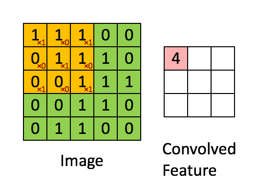
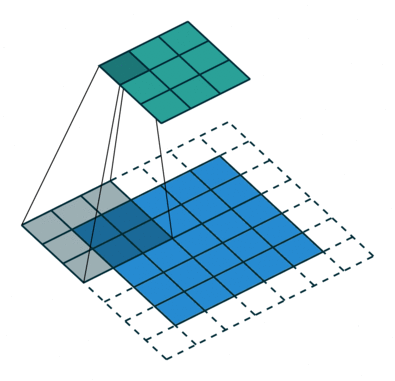
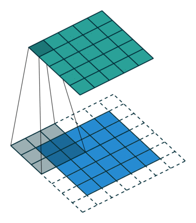

# Сверточные нейронные сети

Сверточные нейронные сети (Convolutional Neural Networks, CNN) являются типом нейронных сетей, которые широко используются для обработки изображений, распознавания образов, анализа видео и других задач, связанных с визуальными данных.

сверточная нейронная сеть состоит из:

сверточные слои (Convolutional Layer)
  Этот слой выполняет операцию свертки над входными данными с использованием фильтров (ядер), чтобы извлечь признаки изображения или других многомерных данных.

  Основные компоненты сверточного слоя:

  
  Фильтры (kernel): это матрица весов, которая скользит по входным данным, умножаясь на соответствующие элементы и вычисляя сумму произведений. 

  Шаг свертки (Stride): Это параметр, определяющий шаг, на который фильтр перемещается по входным данным при операции свертки. Больший шаг уменьшает размер выходной карты признаков.

  

  Заполнение (Padding): Иногда используется заполнение входных данных нулями по краям перед операцией свертки. Это позволяет сохранять размерность входных данных и из3бежать уменьшения размера на выходе.

  

  [доп картинки](https://github.com/vdumoulin/conv_arithmetic?source=post_page-----3bd2b1164a53----------------------)

Результаты этих произведений суммируются, образуя единичное значение в выходной карте признаков (feature map).

пулинговый слой (Pooling Layer)
  Используется для уменьшения размерности пространства признаков и извлечения наиболее значимых характеристик из входных данных.

  Два типа:
  Max pooling
    Максимальный пулинг возвращает максимальное значение из части изображения, покрываемой кернелом.
  Average pooling
    Средний пулинг возвращает среднее всех значений из части изображения, покрываемой кернелом.
  
  

Сверточный и пулинговый слои образуют слои сверточной нейронной сети. Увеличение количества этих слоев может улучшить захват деталей, но требует больше вычислительной мощности. Этот процесс помогает модели изучить признаки перед передачей результатов в fully connected neural network для классификации.

полносвязный слой

