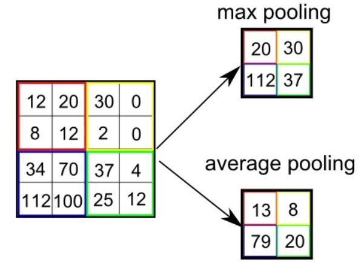

# Сверточные нейронные сети

Сверточные нейронные сети (Convolutional Neural Networks, CNN) являются типом нейронных сетей, которые широко используются для обработки изображений, распознавания образов, анализа видео и других задач, связанных с визуальными данных.

## Input layer

Входные данные представляют из себя цветные изображения, которпя разбивается на 3 канала: red, blue, green. Таким образом получается 3 изображения

## Convolutional layer

Сверточный слой представляет из себя набор нейронов которые получают на вход поочередно определенную область (receptive field или kernel) это называется сверткой

После свертки получается feature maps, которые являются выходом сверточного слоя

Формула:

$$
output = \sum i * k + b
$$

Где:
- \( i \) представляют собой часть входного изображения или предыдущей feature maps.
- \( k \) (receptive field) - это матрица весов, на которую умножаються входные данные.
- \( b \) (bias) добавляется к результирующей матрице после операции умножения входных данных на ядро.

### Гиперпараметры receptive field

**Шаг свертки (Stride):** Это параметр, определяющий шаг, на который receptive field перемещается по входным данным при операции свертки. Больший шаг уменьшает размер выходной карты признаков.

**Padding:** Иногда используется заполнение входных данных нулями по краям перед операцией свертки. Это позволяет сохранять размерность входных данных и избежать уменьшения размера на выходе.

Dilation:

[Доп. картинки](https://github.com/vdumoulin/conv_arithmetic?source=post_page-----3bd2b1164a53----------------------)

## Функция активации

после сверточного слоя можно выход каждого нейрона прогнать через нелинейную функцию активации (например: ReLu)

## Pooling Layer

Цель слоя – уменьшение размерности карт предыдущего слоя. Если на предыдущей операции свертки уже были выявлены некоторые признаки, то для дальнейшей обработки настолько подробное изображение уже не нужно, и оно уплотняется до менее подробного.

Два типа:

* **Max pooling:** sМаксимальный пулинг возвращает максимальное значение из части изображения, покрываемой кернелом.
* **Average pooling:** Средний пулинг возвращает среднее всех значений из части изображения, покрываемой кернелом.
  

## Fully connected layer

Цель слоя – классификация, моделирует сложную нелинейную функцию, оптимизируя которую, улучшается качество распознавания.

Нейроны каждой карты предыдущего подвыборочного слоя связаны с одним нейроном скрытого слоя. Таким образом число нейронов скрытого слоя равно числу карт подвыборочного слоя, но связи могут быть не обязательно такими, например, только часть нейронов какой-либо из карт подвыборочного слоя быть связана с первым нейроном скрытого слоя, а оставшаяся часть со вторым, либо все нейроны первой карты связаны с нейронами 1 и 2 скрытого слоя.