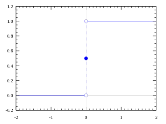
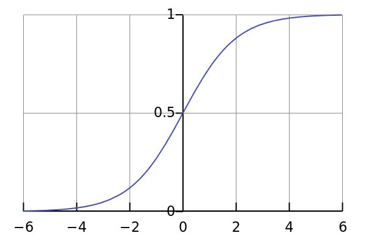
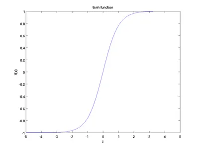
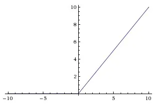

# Neural Network

**Нейрон** — получает информацию, вычисляет взвешенную сумму входных данных и добавляет смещение.
Все нейроны в сети делятся на три группы:

* Входные нейроны, получающие информацию из внешнего мира;
* Скрытые нейроны, обрабатывающие эту информацию;
* Выходные нейроны, которые производят вывод.

**Синапсы в нейронной сети** - это связи между нейронами, через которые передаются сигналы. Каждый синапс имеет вес.

**Вес(weight)** - это коэффициент, который определяет, насколько сильно один вход влияет на выход нейрона. Веса могут быть положительными или отрицательными.

Веса в нейронной сети обычно инициализируются случайными значениями. В процессе обучения нейронной сети веса адаптируются таким образом, чтобы нейронная сеть могла выполнять требуемую задачу.

**Нейрон смещения (bias)** - это особый тип нейрона в нейронной сети, который не имеет входных синапсов. Его выход всегда равен 1, а значение смещения добавляется к суммарной активации взвешенных входов нейрона перед передачей ее в функцию активации.

Смещение позволяет нейронной сети смещать предсказания в нужном направлении и улучшать качество обучения. Например, если нейрон должен классифицировать изображения собак и кошек, то смещение может быть использовано для того, чтобы сдвинуть график функции активации таким образом, чтобы нейрон был более склонен к классификации изображений как собак, если на изображении есть много пятен, или как кошек, если на изображении есть много полос.

## Функция Активации

Пример простого нейрона:
$$
y = \sum{w * x} + b
$$

В данном случае значение $y$ может быть в диапозоне $[+\infty, -\infty]$

Для того чтобы решать активировать нейрон или нет, нужно добавить функцию активации

### Ступенчатая функция

Если значение $y > 0$ то активен если меньше то нет.

### Линейная функция

$$
y = kx
$$

Это функция, где активация пропорциональна входу, и мы можем объединить несколько нейронов, чтобы принять решение на основе их активации. Однако у этой функции есть проблемы. Например, градиент этой функции постоянен, что делает обучение сложным. Если происходит ошибка, изменения, внесенные для исправления этой ошибки, также будут постоянными и не зависят от входных значений.

Другая проблема заключается в том, что при использовании линейных функций активации в слоях нейронов каждый следующий уровень также просто вычисляет линейные комбинации предыдущего уровня. Это означает, что даже при наличии нескольких слоев сети, она может быть эквивалентна всего лишь одному слою с линейной активацией. Таким образом, несмотря на сложность структуры, весьма ограниченный набор функций может быть представлен одним слоем.

### Сигмоидальная функция

$$
y = \frac{1}{1 + e^{-x}}
$$

Сигмоидальная функция ограничивает выходные значения в диапазоне (0,1). Это полезно для классификации, так как ясно разграничивает прогнозы.

Однако у сигмоидальной функции есть проблема "исчезающих градиентов": в областях, где функция практически горизонтальна, градиент становится крайне малым или исчезает, что затрудняет обучение сети или делает его медленным.

### Tanh функция

$$
tanh(x) = \frac{2}{1 + e^{-2x}} - 1
$$

$$
tanh(x) = 2 * sigmoid(2x) - 1
$$

Диапозон значений (-1, 1)
Крутые производные => градиент сильнее

### ReLu

y = max(0, x)

Relu выдает значение x если больше нуля и 0 в противном случае => диапозон (0, $+\infty$)

## Обучение нейросети

Обратное распространение ошибки(backpropagation) - это метод обучения нейронных сетей, позволяющий вычислить градиент функции потерь по всем весам сети, начиная с выходного слоя и двигаясь к входному слою. Он используется для корректировки весов сети таким образом, чтобы минимизировать ошибку предсказания на обучающих данных.

??? note "Производная функции"

    Производная функции в математике показывает, как быстро меняется значение функции при изменении её аргумента.

    Формально, если у нас есть функция \( f(x) \), то её производная \( \frac{{df}}{{dx}} \) показывает скорость изменения функции \( f(x) \) относительно её аргумента \( x \) в каждой точке области определения функции.

    ??? note "Разбор формулы"
        Обозначение "d" в формулах часто используется для обозначения дифференциала или производной. Например, в дифференциальном исчислении "d" часто ставится перед переменной или функцией, чтобы показать, что происходит дифференцирование по отношению к этой переменной.

        Например:

        - \( dy \) и \( dx \) в формулах представляют дифференциалы переменных \( y \) и \( x \) соответственно. \( \frac{{dy}}{{dx}} \) представляет производную функции \( y \) относительно \( x \), которая показывает, как быстро меняется \( y \) при изменении \( x \).

        Это обозначение "d" в формулах представляет концепцию изменения или производной по отношению к указанной переменной или времени в математических выражениях и уравнениях.

    Производная может трактоваться как угловой коэффициент касательной к кривой в данной точке. Если производная положительна, функция возрастает. Если отрицательна, функция убывает. Нулевое значение производной соответствует экстремумам функции (максимум или минимум), а отсутствие производной может указывать на точки перегиба функции.

    Процесс дифференцирования позволяет изучать характеристики функций, их поведение, определять экстремумы, скорость изменения и многое другое, что часто применяется в математическом моделировании, физике, экономике, статистике, а также в машинном обучении при оптимизации функций и обучении моделей.

**Прямое распространение (forward pagation)**

На первом этапе алгоритма происходит прямое распространение сигнала от входного слоя к выходному. Для этого используются следующие формулы:

$$
i = \sum_{}w x + b
$$

$$
o = f(i)
$$

где:

* \( i \) - общий вход узла
* \(o\) - выход узла
* \(w\) - вес между узлами
* \(b\) - смещение узла
* \(x\) - входные данные
* \(f(i)\) - функция активации

Далее вычесляеться ошибка между прогнозируемым и желаемым выходом сети(loss) с использованием функции потерь
Эта ошибка затем обратно распространяется через сеть, вычисляя производные ошибки по весам каждого узла(нейрона).
Производные ошибок вычисляются с использованием цепного правила и определяют, как каждый вес влияет на общую ошибку сети.

??? note "Цепное правило"
    Цепное правило (или правило дифференцирования сложной функции) - это основной принцип дифференцирования функций, состоящих из последовательности других функций. Оно используется для вычисления производных сложных функций, где функция представляет собой композицию других функций.

    Это правило утверждает, что производная сложной функции \( f(g(x)) \) равна произведению производных внешней и внутренней функций:

    Если \( y = f(u) \) и \( u = g(x) \), то производная \( y \) по \( x \) выражается как произведение производной \( y \) по \( u \) на производную \( u \) по \( x \):

    \[
    \frac{{dy}}{{dx}} = \frac{{dy}}{{du}} \cdot \frac{{du}}{{dx}}
    \]

    Это правило позволяет вычислять производные сложных функций путем последовательного применения производных составляющих их функций, что часто встречается в математическом анализе и применяется, например, при обратном распространении ошибки в нейронных сетях для вычисления градиента функции потерь по параметрам сети.

Для этого используются следующие формулы:

$$
\frac{\partial E}{\partial w_ij} = y_i \frac{\partial E}{\partial x_j}
\frac{\partial E}{\partial x_j} = \frac{\partial E}{\partial y_j} \frac{\partial y_j}{\partial x_j}
\frac{\partial E}{\partial y_j} = \sum_{k \in out(j)} w_{jk} \frac{\partial E}{\partial x_k}
$$

где:

* E - функция потерь

**Обратное распространение**

Затем веса корректируются с помощью градиентного спуска: веса обновляются в направлении, которое уменьшает ошибку предсказания.

Формула для вычисления градиента функции \( J(w) \) по параметрам \( w \) включает в себя частные производные относительно каждого параметра:

Если \( J(w) \) представляет функцию потерь (или ошибки), зависящую от параметров \( w \) нейронной сети, то градиент \( \nabla J(w) \) (вектор частных производных) вычисляется следующим образом:

\[
\nabla J(w) = \left( \frac{{\partial J}}{{\partial w_1}}, \frac{{\partial J}}{{\partial w_2}}, \dots, \frac{{\partial J}}{{\partial w_n}} \right)
\]

где:

- \( \nabla J(w) \) - градиент функции потерь по параметрам \( w \)
- \( \frac{{\partial J}}{{\partial w_i}} \) - частная производная функции потерь \( J(w) \) по параметру \( w_i \)
- \( w_i \) - параметры нейронной сети

Этот градиент \( \nabla J(w) \) затем используется в алгоритме градиентного спуска для обновления параметров сети с целью минимизации функции потерь путем коррекции весов сети в направлении, противоположном градиенту.

**Обновление весов**

После вычисления производных ошибки веса сети обновляются с помощью следующего правила:

$$
w_ij = w_ij - \alpha \frac{\partial E}{\partial w_ij}
$$

где:

* α - скорость обучения

**Повторение**

Цикл вычисления производных ошибки и обновления весов повторяется до тех пор, пока функция потерь не достигнет заданного значения или не будет достигнуто максимальное количество итераций.

## [Архитектура нейронных сетей](https://www.asimovinstitute.org/neural-network-zoo/)

