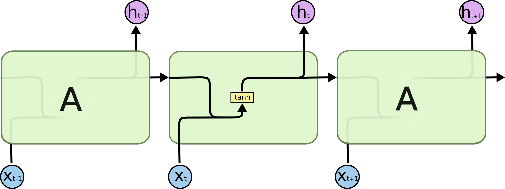
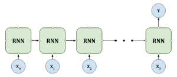
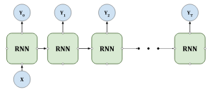
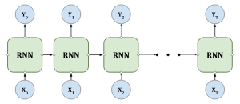
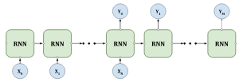

# Рекуррентная нейронная сеть / Recurrent neural network

Изображение можно представить как набор векторов с пикселями каждой колонки. Для классификации изображения необходимо, чтобы сеть запоминала информацию о просмотренных колонках. Аналогично, при классификации эмоционального окраса предложений в естественном языке, сети важно помнить уже переданные слова. При переводе предложений с одного языка на другой также важно учитывать начало, середину и конец предложения.

Как раз задачу “запоминания” предполагается решать при помощи рекуррентной сети. Основная идея RNN заключается в том, что на каждом временном шаге они принимают входные данные (например, эмбеддинги(векторные представления) слов) и обновляют своё hidden state, используя как текущий вход, так и hidden state с предыдущего временного шага. Таким образом, они учитывают контекст предыдущих элементов при обработке текущего.

??? info "эмбеддинг"
    эмбеддинг слова - это числовой вектор, который представляет собой внутреннее числовое представление слова в многомерном пространстве.

    Один из самых популярных методов - Word2Vec, предлагает две архитектуры: Continuous Bag of Words (CBOW) и Skip-gram.

    * В архитектуре CBOW модель учится предсказывать данное (центральное) слово по контексту (например, по двум словам перед данным и двум словам после него).
    * В архитектуре Skip-gram модель учится по слову предсказывать контекст (например, каждого из двух соседей слева и справа);

Это представлено формально следующим образом:

$$
h_t = \sigma(W_{hx}x_t + W_{hh}h_{t-1} + b_h)
$$

$$
y_t = \text{softmax}(W_{yh}h_t + b_y)
$$

Где:

- \(x_t\) - входные данные на временном шаге \(t\),
- \(h_t\) - hidden state на временном шаге \(t\),
- \(y_t\) - выходные данные на временном шаге \(t\),
- \(W_{hx}\), \(W_{hh}\), \(W_{yh}\) - матрицы весов,
- \(b_h\), \(b_y\) - векторы смещений,
- \(\sigma\) - функция активации (например, сигмоида или гиперболический тангенс),

## Варианта конфигурации сети:

### Many-to-one (Многие к одному):
Входная последовательность преобразуется в один выходной результат.

### One-to-many (Один к многим):
Один входной элемент преобразуется в последовательность выходных элементов.

### Many-to-many (Многие ко многим):
И как вход, так и выход представлены последовательностями переменной длины.

### Синхронизированный вариант many-to-many (Синхронизированный многие ко многим)s:
Вход и выход состоят из последовательностей одинаковой длины, где каждому элементу входной последовательности соответствует определенный элемент выходной.

## Bidirectional RNN (BRNN)

Bidirectional RNN (BRNN) - это тип рекуррентной нейронной сети, которая учитывает как предыдущий, так и последующий контекст для каждого элемента в последовательности данных. В BRNN есть две подсети: прямая (forward), которая обрабатывает последовательность в прямом направлении, и обратная (backward), которая обрабатывает последовательность в обратном направлении.

Это позволяет модели учесть как контекст, идущий от начала последовательности к текущему элементу, так и контекст, идущий от текущего элемента к концу последовательности.

## Проблемы RNN

Взрыв градиента (Gradient Explosion): Это явление, при котором значения градиентов становятся очень большими в процессе обучения.

Затухание градиента (Gradient Vanishing): Это явление, при котором значения градиентов становятся очень маленькими по мере прохождения обратного распространения через много временных шагов в RNN. Когда градиенты становятся очень маленькими, веса практически не обновляются.

Один из способов борьбы с взрывом градиента - это метод gradient clipping, который устанавливает максимальное значение градиента. Если градиент превышает установленное значение, он масштабируется до этого значения. Это позволяет предотвратить взрыв градиента, но может быть довольно грубым методом и потеряет часть информации, содержащейся в градиентах.

## RNN с долгосрочной краткосрочной памятью (LSTM - Long Short-Term Memory)

LSTM состоит из четырех блоков, называемых gates. Эти вентили позволяют LSTM контролировать, какая информация сохраняется в памяти сети, а какая забывается.

Forget gate определяет, какую часть информации из предыдущего состояния сети необходимо сохранить.

Input gate определяет, какую часть новой информации необходимо добавить к состоянию сети.

Cell state хранит информацию, которая должна сохраняться в течение длительного времени.

Output gate определяет, какая часть информации из состояния блока должна передаваться на выход сети.

## GRU (Gated Recurrent Unit)