# БИРЖЕВЫЕ МАНИПУЛЯЦИИ
<small>автор: [Новиков Дмитрий](https://www.novik.ru/index.html)</small>

!!! warning ""
    Эта книга не о том, как заработать на бирже, хотя вы можете и заработать. 
    Эта книга о том, как устроена эта индустрия.

Смысл жизни крупного биржевого игрока заключается в том,
что бы раскачав цены на рынке, получить прибыль на разнице в цене.
Поэтому крупные спекулянты постоянно пользуются различными методами
манипулирования рынками.

Хедж-фонды манипулируют ценами используя технологии,
в которых учитывается всё, от технических и финансовых
возможностей игроков до психологии человека.

Практически в любом произведённом товаре заложены цены на энергоносители,
и это делает рынок нефти универсальным средством для
манипулирования ценами на всех других рынках.

Рынок нефти можно использовать для расшатывания экономики всего мира.

Обо всём этом подробно, о биржах вообще,
об алгоритмах биржевых манипуляций,
и кое-что об экономике в целом
в этой книге.

## ПРЕДИСЛОВИЕ

Лет эдак с пятнадцать назад двое моих знакомых решили заработать лёгких денег. Заработать они их решили на бирже, но в те далёкие времена входной билет на торги стоил тысяч десять долларов, по тем временам за эти деньги в Подмосковье можно было купить плохонькую квартирку. Денег у них таких не было, и они взяли эти деньги взаймы. Торговали они по очень простому алгоритму: перед выборами президента или депутатов, когда в дальнейшей судьбе страны не было ясности, и бумаги падали, они на все деньги с плечом покупали какие-то ценные бумаги (я в этом тогда не разбирался), а после выборов, когда ситуация прояснялась, и бумаги подрастали, они закрывали свои позиции, забирали деньги, отдавали долги, а навар оставляли себе. Пару раз у них получилось хорошо, но выборы случаются не так часто, а денег хочется, и они занялись этим более плотно. Я не знаю всех подробностей, им было неприятно об этом рассказывать, но однажды их вынесло на так называемый «маржин-кол», после которого счёт обнулился. Тогда, посмотрев на этих ребят, я решил для себя, что биржа – это очень опасное место, и уж кого кого, а меня на биржу не затащишь. Однако, я ошибался.

Познакомился я тут года три назад с одним товарищем, который рассказал мне, как он хорошо зарабатывает на бирже, как ему это нравится, и как там на самом деле легко и просто зарабатывать деньги. По ходу дела он мне подсунул пару книжечек, дал несколько советов, и я подумал, что наверное, эти мои двое знакомых, потерявших на бирже десятку тысяч бяков, просто что-то неправильно делали. В общем, я решил попробовать поиграть сам, но я решил подойти к этому основательно, хорошо подготовиться, что бы извлекать прибыль на научной основе. Сначала я прочитал несколько книжек о том, как играть на бирже. Потом сделал себе программку для анализа хода торгов в реальном времени с учётом каждой сделки по интересующей меня бумаге (для отладки программы пришлось внести тридцать тысяч рублей на свой счёт у брокера). Пытался сделать биржевого робота, но тут-то я и понял, что никакой, абсолютно никакой технический анализ не работает. Бывали моменты, когда хорошо работал один метод, бывали дни, и даже недели, когда работал другой, но моменты переключения условий всегда были неожиданностью, и никогда заранее нельзя было сказать, какой же метод будет работать сегодня или даже через два часа. Тогда я стал разбираться с экономикой, решив действовать на основе не технического, а фундаментального анализа. Я положил приличных денег на счёт, и начал играть. И тут грянул кризис 2008-го года. Сейчас мне легко об этом писать, потому что я уже отыграл все свои потери, и даже вышел в плюс, но то был шок, потому что в кризис я понял, что не работает ни технический, ни фундаментальный анализ. Рынком рулят монстры, ворочающие сотнями миллиардов долларов. Наблюдая за торгами я обнаружил пару десятков алгоритмов, которыми они пользуются, и думаю, что эти алгоритмы везде одинаковы – будь то нефть, сахар, металлы или другие ресурсы, будь то акции, будь то валюта... Всё, что угодно. Крупные спекулянты, типа хедж-фондов, ставят на всё практически любую угодную им цену, и совершают выгодные для себя сделки. Здесь я пишу о том, как (с моей точки зрения) это всё происходит.

## МАНИПУЛИРОВАНИЕ ЦЕНАМИ НА РЫНКЕ ЦЕННЫХ БУМАГ

Что касается манипулирования ценами именно на рынке ценных бумаг, то в основном там всё происходит как и на рынках вообще, то есть алгоритмы манипулирования те же самые, но есть здесь, конечно, своя специфика. Специфика эта заключается в том, что в отличие, например, от сырьевых рынков, где товар не может стоить ноль рублей и ноль копеек, по крайней мере такая ситуация практически невозможна, на рынке ценных бумаг такая ситуация очень даже может быть. Это происходит тогда, когда эмитент каких-нибудь акций попросту говоря обанкротился, и у него долгов больше, чем активов. В этом случае акции такого эмитента можно просто выбросить на помойку. В связи с этим раскачивать цены на рынке ценных бумаг гораздо легче, чем на рынке сырья — никакое сырьё не может прыгнуть в цене в тысячу раз, и не может упасть до нуля, а на рынке ценных бумаг такие ситуации — не редкость. Именно поэтому основные массы спекулятивного капитала крутятся именно на рынках ценных бумаг, на остальные рынки спекулянты приходят не столько для того, что бы именно там заработать денег, сколько для того, что бы раскачивая цены на сырьё влиять на рынки ценных бумаг. Причём, раскачивая цены на сырьё, хедж-фонды даже могут позволить себе нести там убытки, если они покрывают эти потери доходами на рынках ценных бумаг. А учитывая, что колебания цен на рынках ценных бумаг значительно превышают колебания цен на сырьевых площадках, доходы на фондовом рынке могут так же многократно перекрывать расходы на манипулирование ценами на сырьё.

В качестве основного инструмента манипулирования всеми рынками используется рынок нефти, поскольку от цен на нефть зависит вся энергетика и транспорт, то есть в ценах на все товары, производимые в мире, в той или иной степени присутствует цена на энергоносители, и цена на нефть здесь является во многом определяющей. Следовательно, раскачивая цены на нефть, можно раскачивать все рынки одновременно, и вместе с ними расшатывать экономику всего мира. Поэтому, кстати, для решения вопросов энергетической безопасности, о которой так любят говорить в Европе, надо сначала искоренить возможность спекулирования на рынках нефти (ибо цены раскачивают спекулянты). Европа пытается решать этот вопрос путём диверсификации источников поставок нефти и газа. Не тем вопросом они занимаются — лучше бы поработали над тем, как вышибить спекулянтов с сырьевых рынков, от этого было бы гораздо больше толку.

В том, что касается «технических манипуляций» (как я это называю), никакой разницы между фондовыми, сырьевыми, валютными или другими рынками нет. Об этих алгоритмах подробнее в главе «Манипулирование ценами на рынках».

## ПОТРЕБЛЕНИЕ НЕФТИ В США

Меня всегда забавляло то, как американские нефтяные фонды ухитряются ронять цены на нефть, увеличивая её закупки. Делается это очень просто: закупается нефти больше, чем её реально надо на данный момент, за счёт этого увеличиваются запасы нефти, о чём трубят все СМИ, совершенно не задумываясь о смысле сказанного. Пользуясь расхожей фразой «запасы нефти выросли» нефтяные фонды обваливают котировки. С моей точки зрения было бы разумнее смотреть на потребление нефти, а не на её запасы.

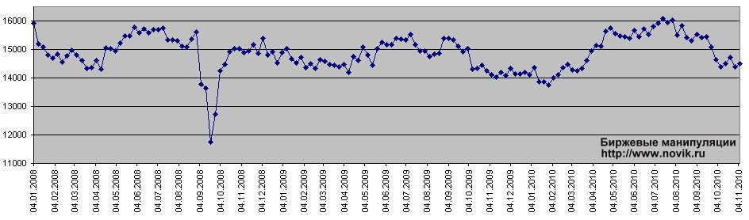
<figcaption><small>График потребления нефти в США за 2008-й — 2010-й годы., в тысячах баррелей в сутки. По данным EIA (U.S.Energy Information Administration).</small></figcaption>

Если смотреть на потребление нефти в США, то можно заметить, что оно очень сильно падало в сентябре — октябре 2008-го года, хотя цены на нефть тогда оставались на уровнях выше 80 долларов за баррель, однако уже к концу октября потребление восстановилось, и продолжало оставаться на давно привычных уровнях — в районе 14 — 15-ти миллионов баррелей в сутки. В первом квартале 2009-го года потребление в среднем оставалось лишь на 200 тыс. барр. в сутки ниже значений годом ранее. К слову сказать, 200 тысяч от 14 миллионов — это менее полутора процентов :).

Первоначально, когда я с этим только начал разбираться, я сделал предположение, что раз потребление нефти практически не изменилось, значит и топлива они потребляют как раньше, или почти как раньше, а значит в экономике США всё не так плохо. Однако, я ошибался. Как выяснилось в последствии, США импортируют не только нефть, но и уже готовое топливо, причём в предкризисные годы они импортировали его в весьма приличных количествах, сравнимых с количеством импортируемой нефти, и если посмотреть на рынок нефти с учётом импорта ещё и топлива, то надо смотреть уже не просто на запасы нефти, к чему нас призывают так называемые эксперты, и даже не на запасы бензина, а смотреть надо на потребление топлива. Причём, если нас интересует цена на нефть, то смотреть надо на потребление именно топлива, производимого из нефти и нефтепродуктов.

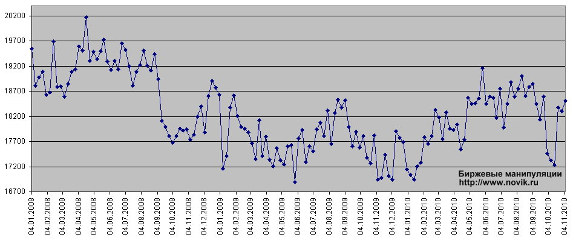
<figcaption><small>График потребления топлива в США за 2008-й — 2010-й годы., в тысячах баррелей в сутки.
(Здесь учтено потребление только топлива, получаемого из нефти.) По данным EIA (U.S.Energy Information Administration).</small></figcaption>

Как видно на графике, к весне 2009-го потребление топлива снизилось с диапазона 2008-го 18,5 — 19,5 млн. баррелей в сутки до диапазона 17 — 18 млн. баррелей в сутки, то есть в среднем — на 1,5 млн. баррелей в сутки, или примерно на 7,5%. Я пока не выяснил, откуда США топливо импортировали, но ясно, что при снижении потребления топлива Штаты снизили импорт топлива и практически восстановили импорт нефти, что позволило сохранить загрузку производственных мощностей своих НПЗ.

В начале июля 2009 было много разговоров о выросших до максимального за более чем 20 лет уровня запасах дисциллятов, в число которых входит дизельное топливо, и на этом основывались объяснения падения цен на нефть в те дни, но я думаю, что в случае существенного избытка предложения по диз-топливу американцы поступят как и в начале кризиса, а именно — снизят импорт дисциллятов, оставив потребление нефти на прежних уровнях.

И всё таки, на что смотреть, если надо прогнозировать цену на нефть? Предлагаю сопоставить все графики.

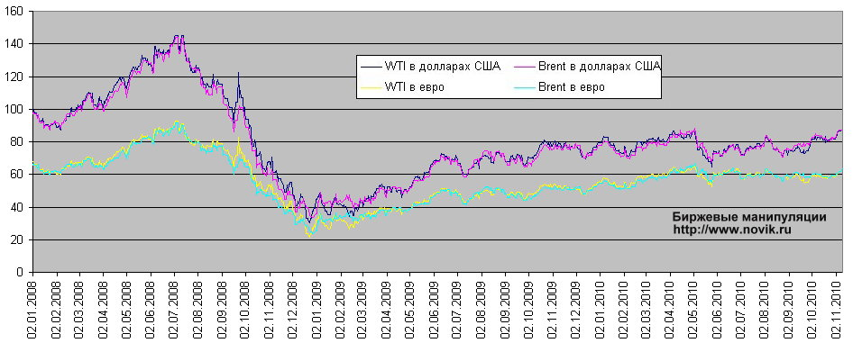
<figcaption><small>Цена барреля нефти в США за 2008-й — 2010-й годы. По данным EIA (U.S.Energy Information Administration).</small></figcaption>

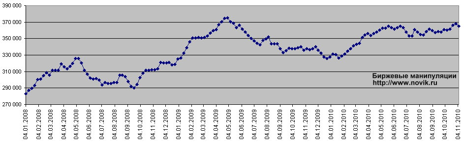
<figcaption><small>Запасы нефти в США за 2008-й — 2010-й годы. По данным EIA (U.S.Energy Information Administration).</small></figcaption>

Как видно из графиков, цена барреля нефти не соответствует ни потреблению нефти, ни запасам, ни потреблению топлива, хотя с потреблением топлива некоторая корреляция имеется, но тоже далеко не всегда. Правда, движение цен имеют явно завышенную амплитуду, совсем не соответствующую изменению потребления топлива (а в конечном итоге — потребления нефти, но уже не только в США). Если посмотреть на всплеск цены на нефть во второй половине сентября 2008 года, можно заметить, что поводом к росту цены на нефть тогда явилось именно снижение запасов нефти. Это произошло в тот момент, когда по причине снизившегося потребления топлива сперва упало потребление нефти, за которым последовало резкое снижение импорта топлива, после чего потребление нефти восстановилось. Естественно, что нефтяные фонды, которые занимаются этим рынком давно и всерьёз, прекрасно знали обо всех этих тонкостях, и они задрали цену крича о снижении запасов, что бы слить свои фьючерсные контракты подороже или даже поиграть в короткую.

Что бы было понятнее, что происходит иногда в США с ценами на нефть, я решил опубликовать ещё пару графиков:

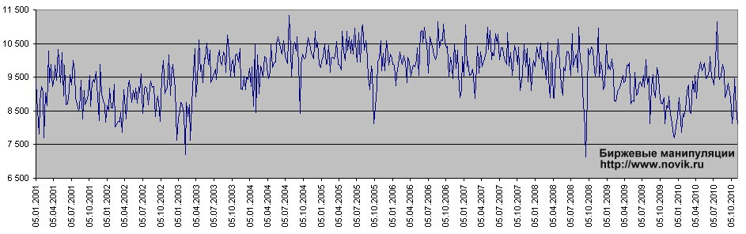
<figcaption><small>Импорт нефти в США за 2001-й — 2010-й годы, в тысячах баррелей в сутки. По данным EIA (U.S.Energy Information Administration).</small></figcaption>

Глядя на этот график становится понятно, как могут снижаться запасы при низком потреблении и нефти, и топлива.

Наряду с графиком импорта нефти полезно взглянуть на график добычи нефти в США. С моей точки зрения эта информация также является важной для понимания возможных долговременных тенденций в цене на нефть.

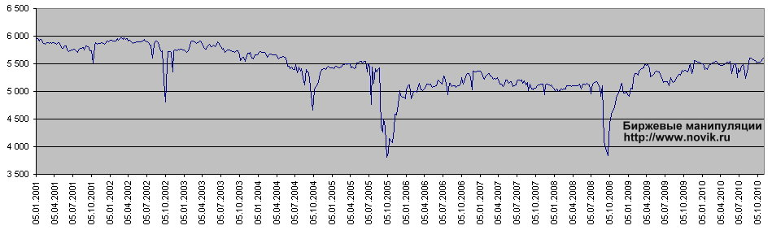
<figcaption><small>Добыча нефти в США за 2001-й — 2010-й годы, в тысячах баррелей в сутки. По данным EIA (U.S.Energy Information Administration).</small></figcaption>

Здесь видно, что с середины 2009-го года добыча нефти в США держится на довольно высоком уровне, что играет не в пользу высоких цен на нефть, особенно на фоне низкого потребления и нефти и топлива. С другой стороны, это может говорить о том, что рост добычи обусловлен именно высокими ценами на нефть, то есть дополнительная нефть поступает с тех скважин, на которых себестоимость добычи довольно высока, и в периоды низких цен на нефть эти скважины находятся в законсервированном состоянии.

Какой вывод можно сделать, имея все эти данные? Вывод, собственно, напрашивается сам собой: цена на нефть практически ни от чего не зависит, и устанавливается крупнейшими биржевыми спекулянтами, которые к нефти никакого отношения не имеют — только к финансам и к биржевым манипуляциям. Именно поэтому прогнозировать цены на нефть невозможно - их можно только устанавливать, если у вас достаточно много денег и имеется достаточно развитая технология биржевых манипуляций.

## ПРОГНОЗ ПО НЕФТИ

05 июня 2009 года на Санкт-Петербургском международном экономическом форуме провели интересный эксперимент: участникам форума предложили проголосовать за оптимальный диапазон цен на нефть. Представители нефтедобывающих компаний голосовали отдельно ото всех остальных участников форума. Надо заметить, что люди на этом форуме не случайные, все приехали по приглашениям, а приглашают туда крупных бизнесменов и представителей компаний, которые известны не только у себя на родине но и за рубежом. Дык вот. На голосование было представлено несколько десятидолларовых диапазонов цены, в том числе диапазоны 70 — 80 и 80 — 90 долларов за баррель (д/б). Другие диапазоны я не рассматриваю, поскольку подавляющее большинство голосов расположилось именно в этих двух диапазонах. Голоса представителей нефтедобывающих компаний поделились почти поровну между этих двух диапазонов, но большинство попало всё таки в 70 — 80 д/б. (Лично я делаю из этого вывод, что практически все нефтедобытчики согласны на диапазон 75 — 85 д/б.) Примечательно, что за диапазон выше 100 д/б не проголосовал ни один из представителей нефтедобывающих компаний. Все остальные участники форума проголосовали в подавляющем большинстве за диапазон 70 — 80 д/б.

О чём это говорит, надеюсь, понятно: <b>авновесная цена на нефть</b>, которая устроила бы всех, как производителей, так и потребителей, <b>лежит в диапазоне 70 — 80</b> долларов за баррель. Однако мы знаем, кто реально устанавливает цены на нефть — это ни в коем случае не потребители, и уж никак не производители (добытчики). <b>Цены на нефть устанавливают спекулянты в лице хедж-фондов</b>. Но смысл жизни спекулянтов заключается в том, что бы как можно сильнее раскачать цены на всех рынках, и извлечь из этого максимальную прибыль.

О том, почему спекулянтам так выгодно раскачивать цены на сырьевых рынках читайте в главе «Манипулирование ценами на рынке ценных бумаг».

Первоначально (в 2009-ом году) я предполагал, что хедж-фонды постараются держать цены либо выше, либо ниже этого диапазона, но прошедший год показал, что резко двигая цены на нефть вверх-вниз внутри коридора от чуть ниже 60-ти до чуть выше 80-ти можно манипулировать биржами ничуть не хуже, чем двигая ценами от 40-ка до 140-ка бяков за баррель.

Кстати, интересный факт: если зайти на сайт Финама (биржевой брокер), в [раздел теханализа](https://www.finam.ru/analysis/charts/default.asp), и посмотреть на объёмы торгов нефтяными фьючерсами (по месяцам), то можно обнаружить, что объёмы торгов во время самого мощного роста цен на нефть, а потом самого резкого за всю историю их падения, когда цены достигли почти 150 долларов, и потом рухнули к 40-ка долларам за баррель, объёмы торгов были относительно небольшими. Относительно нынешних объёмов, которые превышают тогдашние уже примерно вдвое. Мне и раньше неоднократно приходилось слышать, что объёмы торгов фьючерсными контрактами значительно превышают объёмы реальных поставок нефти, и это объяснялось присутствием на бирже больших массивов спекулятивного капитала. Теперь же выходит, что этого спекулятивного капитала на сырьевых биржах стало ещё больше. Если бы весь этот вновь пришедший капитал принадлежал тем же основным игрокам, что и раньше, его просто не было бы смысла туда вводить.

Пожалуй, это скорее всего наплыв крупных спекулянтов в лице всяческих мелких и средних "инвестиционных" фондов, или большого числа частных спекулянтов. Крупнейшим хедж-фондам в условиях больших объёмов торгов с одной стороны труднее контролировать ситуацию, а потому нельзя слишком сильно раскачивать цены, ибо в этом случае ситуация грозит выйти из под контроля, с другой же стороны, при таких объёмах можно неплохо зарабатывать непосредственно на нефтяном рынке, поскольку движения цен на несколько процентов, помноженные на миллиардные объёмы, дают неплохую маржу. Такое объяснение роста объёмов торгов мне кажется вполне логичным.

## КРИЗИС: КАК ЭТО СЛУЧИЛОСЬ

Академическая экономическая наука учит нас тому, что экономика развивается циклически. Может это и так, по крайней мере новейшая история это вроде бы подтверждает. Но вот у меня лично есть сомнения, действительно ли это естественная цикличность или она всё-таки искусственная? Я склонен считать, что экономика совсем не обязана развиваться циклически, если правильно отрегулировать денежные потоки. Но это тема отдельной главы, а пока у нас вопрос о том, как случился нынешний кризис, мог ли он не случиться, и случайно ли он произошёл, или это хорошо спланированный и неплохо приведённый в исполнение план. Никто сегодня не может наверняка утверждать, что какой-то план действительно был, поскольку доказательств никаких ни у кого нет, но есть некоторые соображения, которые делают наличие такого заранее продуманного сценария вполне правдоподобным.

Сегодня причиной кризиса все считают кризис ипотечного кредитования в США. Формально так оно и есть, однако можно сделать предположение, что кризис ипотеки в США сам является следствием определённых действий финансовых кругов США, которые, в свою очередь, были продиктованы нависшей над США угрозой совсем другого кризиса, гораздо более страшного именно для США, хотя и на других странах тот, более страшный кризис, тоже бы отразился, хотя и не так, как на самих Соединённых Штатах. Американские финансисты, что бы избежать того, гораздо более страшного для них кризиса, вполне могли устроить контролируемый и не такой уж страшный кризис, что бы избежать неконтролируемого обвала американского доллара.

Всё дело в том, что экономика США функционирует во многом благодаря тому, что американский доллар для многих стран является резервной валютой. Это даёт просто невероятные преимущества американской экономике по сравнению с другими — представьте себе: в мире оборот долларов практически соответствует объёмам международной торговли, поскольку большинство стран ведёт большую часть международных расчётов именно в долларах. И чем больше долларов обращается в мире, тем больше денег ФРС США может напечатать, совершенно не опасаясь обесценивания своей валюты, ведь если эмитировать доллары с осторожностью, небольшими объёмами, соответствующими росту международного торгового оборота, то никакой инфляции не предвидится. А если учесть, что во многих странах доллар является резервной валютой, которая накапливается, а никак не используется в торговых операциях, то долларов можно эмитировать даже гораздо больше, чем рост объёмов мирового международного торгового оборота. В результате экономика США имеет возможность получать дополнительные ресурсы в объёмах, соответствующих росту мирового торгового оборота, или даже больше. И всё это просто за счёт печатного станка. И всё бы хорошо, если бы ВВП мира в абсолютном выражении не так сильно отличался бы от ВВП США :). Просто в результате внешний долг США превысил все допустимые пределы, в связи с чем законодательство США пришлось менять, что бы избежать так называемого «технического дефолта». Можно было бы, конечно, просто поумерить аппетиты, и эмитировать не такие количества долларов, что бы внешний долг не выходил за пределы разумного, но в этом случае произошло бы одно из двух: либо доллар начал бы расти по отношению к другим валютам, а это ухудшило бы положение экспортёров Соединённых Штатов, что в свою очередь привело бы к ухудшению и без того плохого внешнеторгового баланса США, либо доллар начали бы замещать другие валюты, а это чревато и падением доходов США от печатного станка, и ростом доходов от своего печатного станка тех стран, чья валюта замещала бы доллар. В общем, это приводило в любом случае к потере определённых позиций самих Соединённых Штатов в мире. Этого нельзя было допускать, поэтому аппетиты никто поумерить не захотел, и законодатели США просто изменили закон. Это стряслось ещё в августе 2007-го года. Но ведь это была временная мера, которую нельзя применять каждый год. В общем, с этим надо было что-то делать.

Что бы было понятно, какая связь у внешнего долга США с объёмами долларовой массы в мире, и почему Америка вынуждена брать в долг за рубежом, необходимо сделать некоторое разъяснение. Конечно, США могли бы и не занимать извне, зачем? Они сами же печатают те деньги, которые потом занимают. Неразумно, вроде. Но тут есть одна тонкость: огромная масса долларов в мире выходит из под контроля финансовых властей США. Эта масса в основном участвует в международных расчётах. Однако международная торговля подвержена существенным сезонным колебаниям объёмов этой самой торговли, что время от времени приводит к высвобождению существенных процентов долларовой массы, к временному выводу части долларов из оборота. Эту массу неиспользуемой валюты надо как-то связывать, что бы она не выливалась на валютные рынки, поскольку это приводило бы к существенным колебаниям курса доллара к другим основным валютам мира. Как можно связать эти деньги? Обычно деньги связываются депозитом, то есть людям предлагают проценты по вкладам, и они кладут свои деньги в банк, пока эти деньги не нужны, а если процентов никто не платил бы, то деньги было бы выгоднее побыстрее потратить, что бы уберечь их от инфляции. Но дело в том, что деньги, лежащие на депозите в банке тоже выходят на финансовые рынки, потому как банкам же надо что-то с этими деньгами делать, что бы они могли платить проценты по вкладам. То есть в случае с избыточной в мировом масштабе долларовой массой этот вариант не проходит. Поэтому американское правительство вынуждено прибегать к зарубежным заимствованиям, да и крупные финансовые институты Штатов этим не брезгуют. Таким образом избыточная масса зелёной бумаги оказывается снова в Америке, а владельцы крупных сумм в долларовом эквиваленте становятся счастливыми обладателями всяческих облигаций американского происхождения, по которым они получают проценты всё той же зелёной бумагой. Эту массу долларовой ликвидности, которая периодически, сезонно, так скажем, оказывается вне оборота, стало такое количество, что оно перевалило за все разумные рамки объёма внешнего долга США. Соответственно, американскими облигациями всю эту массу связать было уже нельзя. Это могло привести к тому, что доллар начало бы, по-нашему говоря, «колбасить» на сезонной основе, что приводило бы к падению доверия к доллару и, как следствие, к снижению его стоимости, причём это снижение могло стать обвальным. То есть, если США отдадут все свои долги, доллар рухнет, и это будет даже не 50%. Я вообще даже боюсь прогнозировать, что это будет.

Я так думаю, что финансовые круги США, вообще-то давно прогнозировали эту ситуацию, и готовились к ней заранее. Как можно к этому подготовиться? Что вообще можно сделать? Ну, честному человеку приходит в голову совсем простая мысль: надо меньше брать в долг и всё встанет на свои места. Но это мысль простого, честного человека, которому не приходится думать ни о мировом господстве, ни о почти полумиллиарде человек народу, которые привыкли хорошо жить, ни о военных доктринах и т. д. и т. п.. А какая мысль приходит в голову государственному мужу или просто финансовому воротиле государственного масштаба? Мысль тоже простая: надо уменьшить количество долларов в мире.

То есть требуется изъять из мировой экономики незанятую в международной торговле долларовую массу. Это позволило бы снизить внешнюю долговую нагрузку на бюджет.

Как это сделать? Продать дешёвых активов втридорога, а потом сказать, что они ничего не стоят. Короче — набрать долгов побольше, и просто не вернуть деньги. Причём активы не должны быть государственные (как гособлигации, например), и не должны быть обеспечены госгарантией, как облигации Фэни Мэй и Фредди Мак, потому что это будет уже дефолт страны, а этого нельзя допустить. Это должны быть частные бумаги частных банков, но в очень большом количестве. Но как сделать, что бы их покупали? Очень просто. Им надо присвоить забубенный рейтинг, но, разумеется, он будет присвоен «ошибочно». Схема очень простая, и не надо быть семи пядей во лбу, что бы до неё додуматься, и если до этого додумались какие-то крупные финансисты, то у них было достаточно денег, что бы это сделать. Конечно, я не могу утверждать, что это именно так и было, но уж очень гладкая и красивая складывается картинка. В общем, мне кажется, что всё именно так и случилось. По крайней мере вероятность того, что так всё и было весьма высока. Спланировали и сделали.

Под это дело, правда, попали и американские банки, но мы пока не знаем, какой процент иностранных активов был в тех банках, которым дали обанкротиться, а какой процент иностранных активов был в банках, которые правительство решило спасать. У меня такой информации нет, но я не удивлюсь, если узнаю, что в обанкротившихся банках иностранных вложений было значительно больше.

Кто от такой махинации пострадал больше всего? Американцы? Отнюдь. Все те деньги, которые собрали под американские ипотечные кредиты по всему миру растворились в американской же экономике. То есть конечно, какие-то отдельные люди в Штатах пострадали, или даже группы населения, но в целом в США денег стало только больше, просто сосредоточились они в совершенно определённых руках, но мы не знаем, в каких. Возможно, крупные суммы сосредоточились в отдельных компаниях строительного сектора, возможно — в каких-то финансовых кругах, или просто разошлись по стране в виде зарплат и налогов, раскручивая потребительский сектор. Мы не знаем, где деньги, но они где-то там, в Америке. А вот что касается Европы, банки которой вложили самые большие деньги в эту рулетку, то там денег стало реально меньше, и то, что европейские банки вложили в американскую ипотеку, никак не вернулось в Европу, оно всё осталось за океаном. И где после этой махинации находится ЭПИЦЕНТР КРИЗИСА? Правильно. Эпицентр кризиса находится именно в Европе.

### Прогноз по доллару

На основе всего вышесказанного, кстати, можно делать прогноз по доллару. Естественно, нельзя выразить этот прогноз в цифрах, можно только сказать, будет ли доллар расти или падать, и объяснить, почему. Дык вот. В ВТО считают, что в 2009-ом году снижение мировой торговли составит порядка 9%. Соответственно, на такой же объём снизится и потребность в американских долларах. Однако, лишние доллары американцы из мировой экономики уже изъяли. Но вот что будет потом, когда мировая торговля начнёт восстанавливаться? Спрос на доллары снова вырастет. Это приведёт к тому, что доллар начнёт расти. Есть, правда, одно «но»: сегодня такие страны как Китай и Россия усиленно борются за то, что бы убрать доллары из своих международных расчётов. Однозначно можно утверждать, что между собой Россия и Китай будут торговать за юани и рубли. К отказу от доллара в международных расчётах сейчас стремятся страны Латинской Америки. Россия призывает страны ОПЕК открыть нефтяную биржу в Эр-Рияде, отказавшись от расчётов в американских долларах. С этой же целью наши сейчас раскручивают Санкт-Петербургскую Международную Товарно-сырьевую Биржу (СПбМТСБ). Европа тоже претендует на свой кусок валютной прибыли за счёт печатного станка, и тоже заинтересована в том, что бы заменить львиную долю долларов на евро. Так что в целом, в перспективе, Россия с Китаем и с Европой, если возьмутся за это дело вместе, могут вывести из оборота огромную массу зелёной бумаги, а если нам ещё и арабы помогут — американский доллар обвалится как никогда. Но это в перспективе. Если же мировая экономика начнёт восстанавливаться раньше, чем Россия, Китай и Европа выведут достаточную массу зелёной бумаги из оборота, то сначала доллар начнёт расти, США смогут снова воспользоваться этой ситуацией, что бы продать миру ещё пару триллионов своих фантиков, и уже только после этого доллар обвалится как никогда. То есть в том, что доллар обвалится, у меня лично сомнений никаких нет. Сомнения есть только в том, успеет ли он ещё раз скакнуть прежде, чем он начнёт падать.

### Второй убитый заяц, или какие ещё выгоды от кризиса получила экономика США

Ну, во-первых, я уже говорил о том, где в результате финансовых махинаций финансистов США оказался эпицентр кризиса — он оказался в Европе. С точки зрения уменьшения привлекательности евро это как нельзя кстати, особенно если вспомнить, что евро является основным конкурентом доллару. Но есть и ещё одна выгода, пожалуй, не менее значимая: резкий спад объёмов мировой торговли и снижение ВВП всего мира. Чем выгоден спад мировой торговли, надеюсь, уже понятно: легче контролировать долларовую массу за пределами США. Что же касается ВВП всего мира – то здесь тоже всё ясно, ведь надо учесть, что экономика США в результате всех махинаций просто ломится от денег, и восстановление этой экономики будет проходить очень быстрыми темпами. Восстановление же экономики всего остального мира может оказаться не таким быстрым, и в результате в ВВП всего мира ВВП США будет занимать ещё большую долю, чем раньше, до кризиса. Это очень выгодно для США, поскольку именно благодаря тому, что их экономика считается локомотивом мировой экономики, валюта этой страны считается самой надёжной, и используется в большинстве международных торговых расчётов, что, как известно, позволяет экономике США получать измеряемые триллионами долларов прибыли просто за счёт печатного станка.

А если вдруг мировая экономика опять станет выходить из под контроля, можно будет ещё раз устроить кризис, снова отобрав у мира лишние доллары, опять получить выгоды, и ещё больше вырастить свою долю в ВВП мировой экономики. И так будет продолжаться до тех пор, пока мир не откажется от доллара, как от международного платёжного средства.

## ДЕЙСТВИЯ ЦБ РФ В КРИЗИСНЫЙ ПЕРИОД

Нередко встречал критику в адрес нашего Центробанка за его действия в разгар кризиса, когда ЦБ РФ поднял ставку рефинансирования до 13%. Критика, в основном, заключалась в том, что в то время, как во всех «нормальных» странах ставку понижают, у нас её повышают, чем только усугубляют кризис.

В целом, для идеальных условий критика правильная, но мы живём не в идеальном мире, и если учесть некоторые тонкости, то наш ЦБ всё делал абсолютно правильно (в разгар кризиса).

Теперь о «тонкостях». Во-первых, во всех «нормальных» странах (в развитых, то есть) деньги, выпускаемые в оборот центробанками, являются валютой, то есть свободно-конвертируемой, а подчас и резервной денежной единицей. Рубль является валютой весьма условно, то есть только на территории бывшего Союза, и то не везде. Поэтому, если развитой стране понадобились деньги, на которые надо купить нефти, к примеру, эта страна в принципе может их просто напечатать, как это делается в США уже много лет. И им не нужны никакие золотовалютные резервы, потому что их валюта обеспечена уже только тем, что её принимают в качестве платёжного средства во всём мире. С рублём всё гораздо сложнее, поскольку наш нынешний российский рубль появился на свет чуть больше десятка лет назад, а те рубли, которые были до него, показали себя не с лучшей стороны. К тому же, у нас такая инфляция, что мало никому не кажется, поэтому рублю, что бы твёрдо стоять на ногах, надо иметь подпорку в виде тех самых пресловутых ЗВР.

Кроме того, у нас население, в прошлом многократно обманутое государством, слабо верит нашему правительству и нашему Центробанку, поэтому многие наши граждане поверили активно распространявшимся у нас слухам о том, что доллар будет стоить 50 рублей, а поверив, побежали менять свои рубли на доллары. Многие банкиры, кстати, тоже решили, что единственным надёжным прибежищем в недобрые времена может быть только твёрдая валюта, в основном зелёная, и стали перекладывать свои активы в доллары или в ценные бумаги, номинированные в оных. На этом фоне появились крупные спекулянты, которые были готовы взять рублей в кредит, что бы поменять их на доллары, подождать, когда рубль рухнет, и затем совершить обратный обмен с хорошей прибылью. Удержать рубль от обвала в таких условиях можно было только одним способом: лишив нашу экономику всех излишков рублёвой ликвидности. Это можно сделать, задрав ставку на невразумительную высоту, что и произошло. Параллельно с этим, для сохранения всё тех же ЗВР и в борьбе за положительный торговый баланс, рубль был контролируемо девальвирован. В результате на экономике задранные ставки по кредитам, конечно, отразились отрицательно, но мы обошлись малой кровью, что называется, поскольку 50 рублей за доллар на экономике отразилось бы куда хуже, чем высокие ставки процентов.

К счастью для всех нас, действия нашего правительства и центрального банка привели к тому, что население успокоилось, рубль стабилизировался, и ставку теперь можно понижать, что, собственно, ЦБ РФ и сделал 23-го апреля сего (2009-го) года.

Надеюсь, наш ЦБ и дальше будет продолжать понижать ставку, ибо экономике нужны дешёвые кредиты. Деньги — это всё таки кровь экономики, и мы сейчас страдаем эдаким «экономическим малокровием» :).

Добавление от 14-го мая: как я и надеялся, ЦБ РФ продолжает выбранную линию, и 13-го мая (хорошее число, не правда ли? :)) ставка опять была понижена. Теперь уже до 12%. В общем, пока всё идёт по плану :).

Добавление от 4 июня 2009: ставка опять была понижена. Теперь до 11,5%.
Так, глядишь, и доверие населения потихонечку вернём, если будем следовать заявленному курсу :).

## ИНФЛЯЦИЯ В РОССИИ или особенности национальной инфляции

Академическая экономическая наука учит нас тому, что ставка рефинансирования влияет на инфляцию всегда обратнопропорционально, то есть чем ниже ставка, тем выше инфляция. На самом деле, это работает далеко не во всех условиях. Фокус здесь в том, что академическая наука рассматривает экономику достаточно отвлечённо, примерно так же, как физики рассматривают газы, представляя их идеальными. Если учесть особенности той или иной экономики, то можно очень легко обнаружить, что в разных экономиках в разное время рост ставки может оказывать как усиливающее, так и подавляющее инфляцию влияние. Для этого достаточно лишь более внимательно посмотреть на структуру денежных потоков. Давайте это сделаем применительно к экономике России.

Пожалуй, я начну со своей теоремы, для которой я приведу доказательство.

Теорема звучит так: на данный момент в России ставка рефинансирования оказывает прямопропорциональное воздействие на инфляцию, то есть повышение ставки усиливает инфляционное давление.

Доказательство:

Итак, для начала нам надо понять, откуда берётся инфляция, и как это может быть связано со ставкой рефинансирования (хоть какая-то связь, прямая или обратная).

Известно, что инфляция появляется в том случае, если количество денег в экономике растёт быстрее объёма товаров, которые можно купить. С этим никто спорить не станет, это написано в каждом учебнике. Это - основная инфляция, и относится она к виду «Инфляция спроса». Конечно, есть ещё нерыночные механизмы инфляции, основанные на монополизме, но здесь мы этот аспект не рассматриваем, ибо нас интересует связь инфляции со ставкой рефинансирования.

Имеется так же «Инфляция предложения» — это когда цены растут потому, что у производителей растут издержки. Такая инфляция возможна, например, при удорожании энергоресурсов, и чем более энергоёмко то или иное производство, тем сильнее подорожают производимые на данном производстве товары. Если объём предложения денег не соответствует объёму предложения подорожавших на основе инфляции предложения товаров, то возникает кризис перепроизводства, имеющий своим последствием снижение производства данного товара.

Теперь о том, какая связь у ставки рефинансирования с этими двумя видами инфляции. От ставки рефинансирования зависит то, какие проценты будут выплачивать те или иные экономические субъекты по взятым ими кредитам. Для двух этих видов инфляции у нас есть два вида субъектов: это потребители и производители. Соответственно, чем выше ставка процентов, тем больше расходы как на потребление, так и на производство. При этом снижается стимул и потреблять и вкладывать в производство. Снижение ставки приводит к стимулированию и того и другого. Что получается? Если при изменении ставки потребление и производство изменяются сбалансировано, то мы не видим совершенно никакого воздействия на инфляцию.

Два примера для детей.

Исходные условия: у нас есть Вася, Федя и Петя.

Вася — строитель, он хочет получить кредит на постройку дома для продажи.

Федя — программист 1С. Он научился настраивать программу 1С и теперь зарабатывает много денег. Федя хочет получить кредит на покупку дома.

Петя — наследник. У него помимо своей квартиры в Москве есть дом под Питером, доставшийся ему в наследство от бабушки.

Теперь примеры с кредитами:

Вася получил кредит на строительство дома, а Федя получил кредит на его покупку. В этом случае деньги, которые получил Вася, обеспечат рост ВВП на стоимость дома, Федя возьмёт у банка именно эту сумму, и пока он не отдаст банку деньги за дом, он будет потреблять именно на эту сумму (плюс проценты) денег меньше, зарабатывая на возврат денег банку. Откуда тут взяться инфляции?

Другое дело, если Васе денег не дали, а дали Феде, который купит дом, построенный в прошлом столетии. Эти деньги сразу попадают в корзину потребителя, потому что Петя, у которого был дом, построенный в прошлом столетии, пойдёт и купит на эти деньги крутую тачку и телевизор во всю стену, а потом будет это всё целую неделю обмывать. Именно такие деньги дают толчок к инфляции.

Эти два примера показывают, в чём заключается разница между сбалансированным и несбалансированным изменением кредитных портфелей банковской системы в целом.

Теперь давайте посмотрим на структуру кредитов в России (для этого у нас есть сайт Центробанка, раздел «Показатели деятельности кредитных организаций»).

Что мы здесь видим?

Всего кредитов выдано по данным на 5-й месяц этого (2009-го) года (рублёвые и валютные) 19,7 трлн. рублей. Из них только 3,8 трлн. физическим лицам.

Другими словами, у нас сейчас кредитный портфель экономики не сбалансирован, большая часть кредитов выдаётся в сферу всяческого бизнеса. Что из этого следует? Из этого следует, что в нынешних условиях ставка рефинансирования наибольшее влияние оказывает на «Инфляцию предложения», поскольку удорожает кредиты предприятиям, увеличивая их издержки. В условиях несбалансированного кредитования мы приходим, как ни странно, к кризису перепроизводства и, как следствие, к снижению этого самого производства.

Вывод: в нынешних условиях снижение ставки рефинансирования снижает инфляцию предложения и мало сказывается на инфляции потребления.

Теорема доказана.

Побочный вывод: снижение ставки рефинансирования жизненно важно для реального сектора экономики и не приведёт к росту инфляции, мало того, снижение ставки приведёт к снижению инфляции в целом за счёт того, что в нынешних условиях воздействие ставки на инфляцию предложения значительно выше, чем на инфляцию потребления.

Ещё один побочный вывод из этой теоремы, очень важный: российской банковской системе надо поработать над сбалансированностью кредитов на потребление с кредитами на развитие сферы услуг и производства. В случае, если кредитная политика банковской системы в целом будет сбалансированной, влияние ставки процента на инфляцию будет сведено на нет.

Дополнение 1.

Мы не рассмотрели ещё один пример для детей (условия остаются те же, то есть Федя хочет купить, Вася построить и продать, а Петя — продать старый дом):

3. (Первые два примера мы уже рассмотрели.) Кредит дали Васе, а Феде не дали. Вася дом построил, но не продал. В результате Федя живёт в съёмной квартире, усиливая инфляцию через выплаты хозяину квартиры, на которые этот хозяин живёт ничего не производя, Вася — банкрот, у банка, который дал кредит Васе, но не дал Феде, начались большие проблемы. Петя, как и в первом примере, выпадает из нашей экономической цепочки.

Данный пример может иметь ещё одну модификацию — это когда Федя, испугавшись либо кризиса, либо процентов по кредиту, просто не пошёл в банк за кредитом, решив повременить с покупкой дома. Вот эта модификация — это как раз то, что сейчас происходит и в России и в Европе.

Дополнение 2.

В свете всего вышесказанного возникает очень интересный метод «таргетирования» (ох уж мне эти модные иностранные словечки) инфляции — это сбалансированная кредитная политика. То есть вместо того, что бы тупо регулировать денежную массу, рост которой не всегда приводит к инфляции, надо стремиться к тому, что бы кредитование производителей и кредитование потребителей товаров и услуг были адекватными друг другу. При этом для того, что бы экономика росла, необходимо, что бы проценты по кредитам были минимальными — чем ниже проценты, тем выше будет экономическая активность всех экономических субъектов, как потребителей, так и производителей.

Здесь есть, конечно, несколько нюансов, которые надо учитывать: деньги, направленные в производство, не всегда быстро приводят к появлению товаров или услуг, поэтому в первую очередь надо обеспечить дешёвыми кредитами те предприятия, которые собираются вложить их в капитальные затраты. Чем быстрее вложение денег в коммерческий проект приносит плоды в виде конкретных товаров и услуг, тем с меньшим разрывом по времени можно запускать в рынок аналогичные суммы для потребителей. В развитых странах в результате долговременного существования системы кредитования на рынок постоянно приходят новые товары и услуги, потребляемые населением, то есть там все временные разрывы давно пройдены и порождённый кредитными деньгами спрос уравновешивается постоянным ростом предложения товаров, в том числе теми производствами, в которые деньги были вложены может быть много лет назад.

В развивающихся странах ситуация совсем другая, поскольку прежде, чем заработает то или иное производство, кредит которому надо дать уже сейчас, пройдёт ещё очень много времени, может быть пару лет. А потребители всё это время будут иметь доступ к таким же дешёвым кредитам, как и производители. Тут, правда, существует один хороший выход: временная замена недостающих товаров импортом — это снизит инфляцию, но ухудшит внешнеторговый баланс. Здесь, правда, есть ещё одно «но»: при этой схеме на инфляции начинает сказываться курс национальной валюты по отношению к валютам стран, из которых импортируется товар. Какой самый лучший выход из такого положения? Самая лучшая стратегия в данном случае — снижение ставок по кредитам до минимальных уровней (близких к нулевым), с целью максимально повысить экономическую активность населения, в том числе предпринимателей, с целью обеспечить экономический рост. Инфляция в этом случае будет расти лишь тогда, когда активность потребителей будет превышать возможности импорта. Можно сделать разными (возможно, даже законодательно) процентные ставки для кредитов на потребление и на развитие производства. (Сегодняшнее субсидирование государством части ставки по некоторым кредитам в России это уже фактически делает.)

Теперь отдельно по России. Сегодня самая большая проблема, тормозящая развитие крупного бизнеса в России — это, конечно, множество самых разнообразных разрешительных документов, которые необходимо согласовать с большим количеством ведомств для получения разрешения на строительство предприятия, и коррупцией, связанной со всеми этими разрешительными бумажками. То есть именно в России сегодня снижение ставки процента без радикального упрощения разворачивания какого-либо бизнеса не приведёт к желаемому результату.

Вывод:

В случае радикального снижения процентных ставок по кредитам основным тормозом на пути развития бизнеса в России становится коррупция, именно поэтому при снижении ставок по кредитам деньги идут в основном на потребление, а не на развитие производства и сферы услуг, следовательно: при низких ставках процентов по кредитам именно коррупция становится в России мощнейшим фактором, усиливающим инфляцию. Инфляцию в России невозможно победить, не устранив коррупционное торможение развития предпринимательства в России.

Длительная война с коррупцией пока не дала результата, и в ближайшее время явно не даст. На сегодняшний день коррупция в России непобедима, но промедление в экономическом развитии смерти подобно.

Коррупция в России будет побеждена только тогда, когда на государственную службу люди будут стремиться попасть не из стремления получить левый доход в виде взяток, а что бы получать высокую, надёжно выплачиваемую зарплату, и всяческие социальные льготы. Ни социальными льготами, ни высокими зарплатами госслужащие похвалиться не смогут ещё долго. Что бы платить госслужащим хорошую зарплату, надо развивать экономику, но экономику крайне трудно развивать при такой коррупции. Этот замкнутый круг необходимо разрывать, поэтому упрощения для развёртывания какого бы то ни было бизнеса должны быть именно радикальными, возможно даже, с временной (а может и постоянной) отменой действия части законов, которые напридумываны именно коррупционным лобби.

Дополнение 3. или Часть вторая.

Анализ зависимости инфляции от ставки рефинансирования, кредитной массы и курса доллара к рублю за 2007-2009 г.г.

Дополнение 4.

Нда. Хотел поразбираться с тем, откуда у нашей инфляции ноги растут, залез на сайт Росстата, порылся в этой базе, дык там всё сделано так, что ничего путного не выявить из этой информации. Ёлы палы!

Дело в том, что можно попробовать сравнить динамику изменения цен производителей на их товар, цены на те же товары в оптовых сетях и в рознице - тогда сразу станет очевидно, откуда куда цена двигалась - то ли производители подняли цены, а потом она пошла расти в опте и в рознице, то ли перекупщики (оптовые сети) подняли цены для розницы, а потом она и у производителя выросла, то ли в магазинах из-за дикого спроса выросла цена и потом пошла расти уже от прилавка к производителю. Метод анализа хороший, но данных нет. На сайте Росстата цены производителей сгруппированы по типам товаров, а розничные цены опубликованы только для готового набора продуктов с ширпотребом. Об оптовых ценах и говорить нечего. Как, имея такую неполную информацию, наше правительство собирается с инфляцией бороться? Ведь неправильная борьба - она может только ухудшить положение в экономике, как это делает повышение ставки рефинансирования.

Был опечален и озадачен. Впрочем, сомневался недолго, и написал об этой неувязке президенту. Опубликовали. Посмотрим на реакцию нашего экономического блока. Надеюсь, она будет не нулевой.

В попытке выявить хоть какие-то зависимости инфляции от кредитной массы, курса доллара и ставки рефинансирования я настроил графиков, которые предлагаю сопоставить.

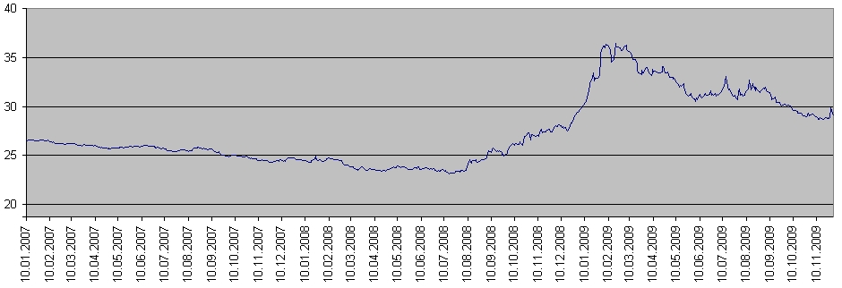
<figcaption><small>Курс доллара к рублю за 2007-й — 2009-й годы. </small></figcaption>

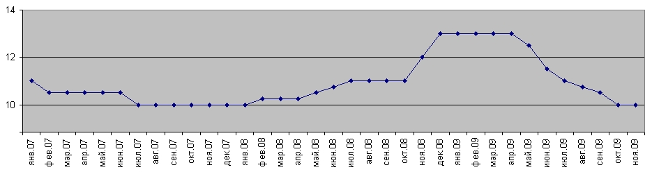
<figcaption><small>Ставка рефинансирования за 2007-й — 2009-й годы.</small></figcaption>

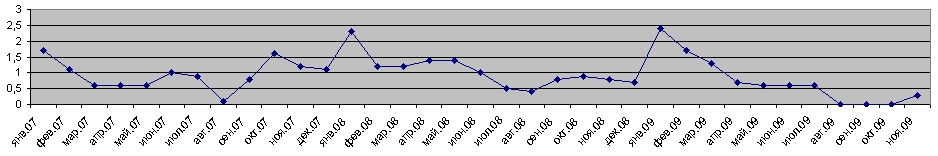
<figcaption><small>Инфляция за 2007-й — 2009-й годы. (В процентах относительно предыдущего месяца. Данные об инфляции по данным ЦБ РФ.)</small></figcaption>

* Когда я впервые строил график инфляции в мае 2009 г., данные о потребительских ценах от Росстата отличались от данных ЦБ по инфляции, поэтому было два графика, немного отличающиеся друг от друга. Когда в январе 2010-го я обратился к сайту Росстата за новыми данными, они уже полностью совпадали с данными ЦБ. Странно, но факт. Вообще, когда графики получались разными и назывались они по-разному, это козалось нормальным. Теперь это выглядит несколько странно :).

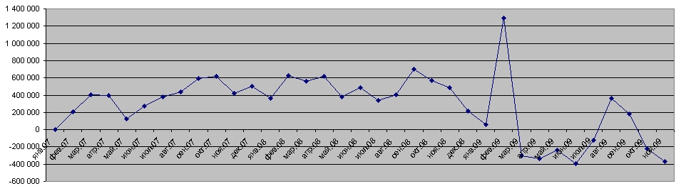
<figcaption><small>Изменение общей кредитной массы (кредиты в рублях и в валюте) 2007-й — 2009-й годы. В миллионах рублей относительно предыдущего месяца. Положительное значение показывает, на сколько кредитная масса выросла, отрицательное - на сколько она упала.</small></figcaption>

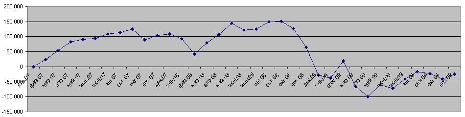
<figcaption><small>Изменение кредитной массы, выданной физическим лицам. 2007-й — 2009-й годы.
В миллионах рублей относительно предыдущего месяца. Положительное значение показывает, на сколько кредитная масса выросла, отрицательное - на сколько она упала.</small></figcaption>

Здесь надо заметить пики инфляции, приходящиеся на начала всех трёх лет. Это может быть связано с уже традиционным повышением тарифов ЖКХ, энергетики и прочих регулируемых тарифов. К ставке рефинансирования, как и к кредитной массе, отношения не имеет. Потребительские цены января - февраля 2009-го года могли расти вслед за курсом доллара, ибо у нас очень большой процент импорта вообще, и в потребительских товарах он тоже заметно присутствует.

Странный подъём потребительских цен и инфляции виден в июле - октябре 2007-го года. С первого взгляда он соответствует ускорению роста общей кредитной массы, но в ноябре наблюдается снижение инфляции несмотря на продолжающийся рост кредитной массы, и затем, после скачка начала 2008-го года, обусловленного ростом регулируемых тарифов, инфляция опять падает не смотря на усилившийся рост кредитной массы. Февраль - март - апрель 2008-го - рост кредитной массы остаётся на уровне около 600 млрд. рублей в месяц, в мае рост падает до примерно 400 млрд. рублей за месяц, а инфляция остаётся вблизи 1,5%. Затем инфляция падает на фоне небольшого увеличения роста кредитной массы. Здесь, правда, происходит снижение курса доллара, что могло привести к удешевлению импорта. Снижение темпов инфляции с января по май 2009-го года тоже связано скорее всего со стабилизацией валютных курсов, а не с тем, что кредитная масса начала уменьшаться. Я такой вывод делаю потому, что довольно сильный скачок кредитной массы в феврале не изменил тенденции в инфляции - она достигала пика в январе, и с тех пор плавно снижалась.

Тут надо заметить, что академическая наука говорит, что рост инфляции следует за ростом денежной массы с отставанием на 4-6 месяцев. Я пока не сопоставлял график инфляции с графиками денежных агрегатов (я ведь пытаюсь выявить зависимость инфляции от ставки рефинансирования), но вот изменение кредитной массы видимого эффекта не производит ни в тот же месяц, когда она увеличилась, ни с отставанием. По крайней мере, даже если эффект этот есть, он теряется на фоне других, более сильных влияний на инфляцию.

В общем, выходит, что помимо ежегодного толчка к инфляции, вызванного ростом регулируемых тарифов, на инфляции сказывается ещё и курс доллара. Рост кредитной массы имеет не всегда однозначное влияние на инфляцию (странно, но факт), соответственно и ставка рефинансирования, которая призвана регулировать рост кредитной массы так же имеет весьма ограниченное влияние, если она его вообще имеет.

Вообще, учитывая, что рост рублёвой ликвидности в России относительно легко можно уравновесить импортом (в случае нехватки товаров), то как раз и получается, что инфляция сегодня зависит больше от курса доллара и таможенных барьеров, чем от ставки рефинансирования. Однако цены на товары, производимые в России, включают в себя ставку по кредитам, которая всегда больше ставки рефинансирования. (Понятно, что есть предприятия, которые обходятся без кредитов, но это те, которые давно построены и имеют уже налаженную систему сбыта. Однако, мы говорим о России, экономика которой является развивающейся, а промышленность без кредитов не поднимешь.) Вот и получается, что конкурентоспособность нашей промышленности впрямую зависит от процентных ставок. От них же зависит и экономическая активность населения. К тому же, высокая ставка нашего центробанка приводит к тому, что предприятия берут кредиты за рубежом (когда это возможно), и ликвидность так или иначе всё равно попадает в страну, только проценты от этих кредитов получают не наши, а зарубежные банки.

В общем, поднятием ставки можно снизить объём ликвидности, что приведёт к снижению потребления, и вместе с ним - снижению импорта. Только цены при этом не упадут, покуда рубль не окрепнет.

Сегодня у нашего центробанка есть прекрасная возможность приучить бизнес брать кредиты в России, а не за рубежом, для этого надо только ставку снизить до минимума, и заставить наши банки тоже снизить ставки по кредитам. Если основная масса кредитов будет получаться в стране, то и ставка нашего ЦБ будет более действенным орудием. А пока это лишь инструмент сужения рублёвой массы, что помогает отстаивать курс рубля на нашем же рынке.

В общем, получается, что наш ЦБ с помощью ставки рефинансирования борется в основном с инфляцией, вызванной ослаблением рубля, а экономическое развитие в стране если и идёт, то в основном за счёт либо зарубежных инвестиций, либо опять же зарубежных займов. Наша банковская система в экономическом развитии участвует очень слабо. Конечно, зарубежные инвестиции и займы приносят в страну валюту, которую здесь приходится менять на рубли, поскольку вся операционная деятельность внутри страны происходит в рублях, и это опять же поддерживает рубль. К чему такая политика нашего ЦБ может привести в перспективе? К тому, что как только иностранные вливания в экономику России перестанут расти, начнётся отток капитала из страны, сопровождающийся обвалом рубля. То есть российский рубль находится в сильнейшей зависимости от иностранных вливаний. При этом банковская система России остаётся в зачаточном состоянии, поскольку из-за высокой ставки рефинансирования и связанными с ней ставками по кредитам не развивается система кредитования. Основные прибыли по кредитам получают зарубежные банки и инвесторы, а у нас банки учатся в основном обналичку делать. То есть наша финансовая система, благодаря политике нашего же ЦБ, является несамостоятельной, ввиду зависимости от иностранных вливаний. Экономика при этом развивается в основном в тех отраслях, которые выгодны иностранным инвесторам и финансистам, а иностранным финансовым воротилам выгодно, что бы Россия оставалась сырьевым придатком мировой экономики. Всё это делает зависимой от внешних влияний и финансовую систему страны, и собственно всю нашу экономику. Но самое главное, что инфляцию с помощью такой политики победить невозможно, поскольку ликвидность всё равно приходит на рынок через иностранные вливания в нашу экономику. Да и как при такой зависимости от внешних влияний можно говорить о рубле, как о резервной валюте, а о стране — как о будущем финансовом центре?

Что делать? Как я уже говорил — снижать ставку рефинансирования до значений, близких к нулевым, и контролировать кредитование, что бы потребительские кредиты не превышали определённой доли в общем объёме кредитов. В добавление к этому необходимо максимально содействовать развитию производства ширпотреба и продуктов питания — это уменьшит влияние курса рубля на индекс потребительских цен и снизит таким образом социальную значимость валютных курсов. Будет гораздо лучше, если мы будем импортировать в основном станки и оборудование, а не чайники и плюшевые игрушки. В любом случае, на то, что мы будем экспортировать что-либо из перечисленного в ближайшем обозримом будущем, надежды мало.

Добавление от 22-го января 2010-го года: очень интересный момент мы наблюдаем, сопоставляя ставку рефинансирования и объём кредитной массы, а именно, при снижении ставки рефинансирования объём кредитной массы не растёт, и даже мало того - он падает. При этом ставки по кредитам нефинансовым организациям (то есть юридическим лицам, кроме финансовых структур) снизились по данным ЦБ РФ в 2009-ом году с 17,4 до 13,6 процентов. Выходит, что снижение почти на четыре процента не приводит к увеличению желающих прокредитоваться. Это может говорить о том, что ставки по кредитам находятся на настолько запредельных уровнях, что их падение на 4% является несущественным. То есть организации не готовы брать кредиты под 13,6% годовых, особенно в условиях ещё незакончившегося кризиса. Понятное дело, что ни о какой модернизации экономики в такой ситуации речи быть не может, поскольку на замену изношенного оборудования в нашей промышленности нужны деньги, а взять их негде, кроме как у банков в кредит. Но никакое промышленное предприятие невозможно модернизировать и окупить модернизацию за такое короткое время как два — три года, на которые наши банки готовы давать кредиты. Соответственно, в нынешних кредитных условиях модернизация невозможна. Промышленность России возможно будет поднять только тогда, когда предприятия смогут получать кредиты на 10 — 20 лет под 2 — 3 — 5 процентов годовых, а для этого надо иметь ставку рефинансирования на уровне около ноля.

При рассмотрении причин инфляции надо учитывать и ещё одну вещь: как правило, банки имеют собственный капитал, составляющий лишь небольшую долю от тех средств, которыми они распоряжается, основная масса денег, которые они выдают в качестве кредитов, является заёмными средствами, в основном состоящими из депозитов населения и организаций. На депозиты начисляются проценты, а что бы их начислить, эти проценты надо сначала взять с тех, кто взял в банке кредит. Любому банку хочется иметь большую прибыль по своим операциям, поэтому банки заинтересованы в высоких процентах как по вкладам, так и по кредитам, поскольку чем выше проценты, тем большей можно сделать разницу между этими двумя ставками. То есть если вы банкир, и платите вкладчику 1% на его вклад, и берёте со своих заёмщиков 2%, то вам остаётся только один процент прибыли, из которого вы ещё должны вычесть операционные расходы и заплатить налоги. Совсем другая ситуация складывается, если вы платите 10%, и берёте 20% годовых — у вас остаётся целых десять процентов от прокрученного капитала. Таким образом, банки сильно заинтересованы в высоких ставках, а соответственно, косвенно они заинтересованы и в высокой инфляции. Причём, когда банки выплачивают своим вкладчикам 10% годовых, они эту самую инфляцию дополнительно раскручивают, ибо это деньги, полученные «из ничего», никак не обеспеченные никаким ВВП. А когда банки берут 20% со своих заёмщиков, то в случае, если заёмщиком является организация, а у нас почти три четверти всех кредитов выдаётся именно юридическим лицам, это раскручивает инфляцию издержек (инфляцию предложения). Вот и получается, что в постсоветской экономике России банковский сектор во главе с нашим Центробанком раскручивает инфляцию в угоду собственным интересам. Вся экономика России в этом случае становится как бы придатком банковского сектора, хотя на самом деле банковский сектор должен быть кровеносной, а не кровососной системой, и банковский сектор должен обслуживать экономику, а вовсе не наоборот. Так вот, пока банковский сектор не будет лишён его сверхприбылей, экономика России будет в лучшем случае стагнировать. Развиваться будет только сырьевой сектор, который получает деньги из-за рубежа под приемлемые проценты, а также торговля, которая у нас столь же сверхприбыльна, как и банковский сектор, и торговые сети могут себе позволить платить такие бешеные проценты, а потом ещё и налоги. Возможно, что бы умерить аппетиты наших «жирных котов» придётся принимать законодательные меры, ибо жадность их безгранична, и добровольно они от своих сверхприбылей не откажутся.

## МАНИПУЛИРОВАНИЕ ЦЕНАМИ НА РЫНКАХ

Прежде, чем говорить о том, как происходят манипуляции с ценами на биржах, надо понимать, как работает механизм биржевого ценообразования. Академическая наука учит нас тому, что цена на свободных рынках формируется соотношением спроса и предложения, то есть когда спрос превышает предложение – цена растёт, если же наоборот, предложение превышает спрос – цена падает. В идеале так оно и должно быть, но мы живём не в идеальном мире, и здесь всё происходит совсем не так. Даже на живом базаре крестьяне могут просто не отдавать свой товар дешевле какой-то цены, потому что по такой цене те же яблоки, например, выгоднее своей корове скормить, то есть даже при значительном превышении предложения над спросом цена может дальше уже не падать. Что же касается биржи, то тут, помимо собственно спроса и предложения, присутствует масса других рычагов давления на цену, как прямых, так и косвенных, и самое большое влияние на цены оказывают самые крупные спекулянты, которыми на сегодняшний день обычно являются хедж-фонды (англ. hedge fund). Хедж-фонды оперируют массивами активов, измеряемыми десятками, а иногда и сотнями миллиардов долларов, и могут себе позволить использовать в своей работе все последние достижения научной мысли, к чему бы она не относилась, и кстати, они этим пользуются. (О том, как функционируют хедж-фонды есть хорошая статья в журнале «Компьютерра», называется «Человек ренессанса» в №8 от 25 марта 2008 года.) Поскольку цены на биржах формируются крупными спекулянтами, для понимания всех происходящих на торгах и вокруг них процессов, надо разобраться, что же такое эти самые спекулянты. Что бы понять, что такое спекулянт, надо им стать :). Сделаем это виртуально.

### ЖИЗНЬ БИРЖЕВОГО СПЕКУЛЯНТА

#### Рождение

Начнём с того, что биржевые спекулянты бывают разные: это может быть физическое, или юридическое лицо, и массивы средств у них бывают очень разные, но любой, даже самый крупный хедж-фонд создаётся людьми, которые с чего-то начинали. Не буду сейчас углубляться в историю биржи, когда всё зарождалось, в те далёкие времена жизнь спекулянта была совсем другой, а начну с того, как сегодня спекулянт начинает свою деятельность.

#### Действие первое. Вовлечение в процесс.

Возможно, человек видит завлекательное объявление в метро или на сайте в интернете о том, что кто-то научит его зарабатывать несметные богатства на бирже, причём иногда обучение практически бесплатное, с зачислением части оплаты за обучение на брокерский счёт нового клиента. Иногда человек думает, а не попробовать ли на самом деле поиграть в эти игры. Потом оказывается, что для того, что бы получить доступ на биржу, надо добавить на счёт денег до некоей суммы, а при снятии суммы со счёта обязательно берётся подоходный налог. В результате человек уже попал в эти сети.

Иногда человек встречается с кем-то, кто уже поигрывает на бирже, но люди чаще всего стараются выглядеть лучше, чем они есть на самом деле, и в попытке выглядеть успешным, играющий на бирже человек рассказывает, как у него всё неплохо получается.

Конечно, и телевидение тут помогает биржам и брокерам, у них ведь даже каналы свои есть, где круглые сутки обсуждают положение на биржах всего мира, и время от времени народ на всё это смотрит и начинает интересоваться.

Вообще говоря, это целая индустрия, причём это индустрия казино, поскольку движения цен на биржах очень и очень слабо зависят от экономических реалий, достаточно вспомнить смехотворный случай с ценами на акции Сургутнефтегаза в 2008-м году — они упали настолько, что стоимость компании снизилась в несколько раз ниже объёма средств, имевшихся на банковских счетах этой компании, а ведь у Сургутнефтегаза помимо денег на счетах есть ещё много других активов. Понятное дело, что это выходит за рамки сколь-нибудь здравой логики, но в этом-то весь и секрет, что игры на биржах всего мира уже давно находятся за пределами сколь-нибудь здравой логики, и я намерен здесь это многократно продемонстрировать.

Кстати, брокеры берут маленький процент за каждую сделку на бирже, и биржа берёт свой процент. Долю они берут небольшую — в сумме десятые доли процента, но умножьте эти доли на сотни миллиардов, прокачиваемые на биржах каждый день*, что бы понять, каковы масштабы этой индустрии. И это не считая денег, которые там ежедневно проигрываются! Игровым автоматам такие масштабы и не снились.

(*Суммарный объем биржевых торгов на всех рынках Группы ММВБ за первые три месяца 2008 года составил 26,8 трлн рублей. Чистая прибыль ЗАО ММВБ составила 583 млн. рублей. Брокер берёт за проведённые через него сделки на бирже на порядок больший процент, чем сама биржа, то есть не будет большой ошибкой сказать, что в целом в России эта индустрия заработала порядка 5 млрд. рублей только за первый квартал 2008-го года. И это — чистая прибыль по самым скромным прикидкам.)

#### Действие второе. Обучение.

Вот тут начинается самое интересное: все книги, касающиеся этого казино (то есть, простите, биржи), которые вы сможете купить в магазине — это, естественно, «бестселлеры», как у нас это теперь называют, их прочитали миллионы несчастных, которые так и не стали миллионерами (иначе с бедностью мы бы уже давно покончили), и теперь эти прекрасные книги ждут вас, когда вы тоже их прочитаете, что бы играть по правилам. А кто эти правила придумал, вы ещё не догадались? Их придумали люди, работающие на эту индустрию.

О чём все эти книги? Конечно, если вдаваться в подробности, то в несколько строк не уложишься, ведь там описываются сотни случаев движения котировок, десятки методов технического анализа, всё это сопровождается многочисленными математическими выкладками, мудрёными фразами и терминами. Сложные книги, прямо скажем. Но есть буквально несколько вещей, которые все эти книги объединяют, а именно: вас приучают к тому, что надо продавать на падении, и покупать на росте, а что бы не войти в позицию слишком поздно, когда уже наметился разворот, надо применять один из методов технического анализа, правда никто не знает, какой именно метод из нескольких десятков приведённых в книгах сработает в данном конкретном случае. Кроме метода надо ещё правильно выбрать период, на котором вы работаете — по часам, по дням, по неделям или по минутным интервалам. На самом деле ни один из методов не работает — это всё мифы для новичков, что бы они не боялись играть, что бы проигрывая раз за разом они не бросали это дело, а упорно искали бы свой «философский камень» – волшебное сочетание периода и метода технического анализа.

Один из крупнейших брокеров России постоянно объявляет конкурсы на лучшего биржевого робота, точнее на лучший алгоритм технического анализа, который бы зарабатывал деньги. Ни один из представленных алгоритмов не может зарабатывать в любых условиях — если условия благоприятны для какого-то одного алгоритма, он и выигрывает, если для другого — выигрывает другой. Но условия всё время меняются, а монстры (как я их называю), то есть самые крупные биржевые спекулянты, которые задают тон всем торгам, тщательно отслеживают появление всех новых алгоритмов анализа. Для этого, собственно, все эти конкурсы и проводятся.

В общем всё обучение новичков нужно монстрам для того, что бы легче было направлять стада мелких спекулянтов в нужную сторону. Ведь если все приучены работать по уровням Фибоначчи, то надо лишь пробить некий уровень, что бы сотни тысяч мелких спекулянтов слили все свои бумаги по низким ценам. А на другой день можно так же легко и просто заставить их выкупить всю бумагу обратно, но уже на несколько процентов дороже. Это очень удобно, если у тебя много денег, и на бирже пасутся огромные стада хорошо выдрессированных спекулянтов с деньгами – в этом случае биржа превращается в огромный денежный насос.

Кстати, знаете, почему спекулянтов приучают продавать на падении и покупать на росте? Потому, что самые большие деньги можно сделать на самых больших колебаниях цен, поэтому всех новичков учат, как надо правильно раскачивать цены. Именно поэтому цены на акции часто выходят за пределы всякой логики.

#### Действие третье. На распутье.

Рано или поздно у мелкого спекулянта заканчиваются либо деньги, либо терпение, либо и то и другое вместе, и он перестаёт искать свой «философский камень», уходя с биржи.

Конечно, бывает и по-другому: особо упрямые становятся профессионалами. Они либо очень хорошо чувствуют, чего хотят монстры, и всё время подыгрывают им, и оказываются почти всегда в плюсе (хотя иногда монстры и этих ребят «обувают»), либо они становятся инвесторами, которые вкладывают деньги в надёжные бумаги, когда они упали за пределы логики, и потом забирают деньги, когда эти бумаги выросли если не за пределы логики, то хотя бы до обоснованных уровней.

Первый вариант профессионала — это очень нервная и кропотливая работа, при которой человек целыми днями не может оторваться от монитора. Это «внутридневной» спекулянт. Второй вариант — это спекулянт-инвестор. Он совершает сделки не чаще двух-трёх раз в году, и зарабатывает иногда не меньше «внутридневного», но практически не тратит на это ни собственное время, ни силы, ни нервы. Лично я превратился в спекулянта-инвестора.

## МОНСТРЫ БИРЖЕВОЙ ИГРЫ

Теперь о тех, с кем приходится иметь дело стаду мелких спекулянтов. Это супер-крупные спекулянты, которые в состоянии выкупить если не всю бумагу какой-нибудь «голубой фишки» то, по крайней мере, большой её процент, что бы не сказать «львиную долю». Обычно это хедж-фонды. Некоторые из них ворочали объёмами, превышающими 100 млрд. долларов США. На сегодняшний день (Май-2009) самые крупные хеджевые фонды оперируют объёмами от 10-ти до 30-ти млрд. долларов США. Примерно половина хедж-фондов мира объединена в фонды хедж-фондов (ФХФ), что позволяет из одного центра управлять объединёнными массивами средств, которые многократно превышают средний объём средств отдельных хедж-фондов. Большинство специалистов оценивает долю хедж-фондов в общем объёме торгов на рынках всего мира приблизительно в 50%. То есть как раз одна половина общего объёма торгов приходится на спекулянтов всех мастей, а другая половина — на хеджевые фонды. Вот и получается, что стаду мелких спекулянтов противостоят хеджевые фонды с объёмами средств, измеряемыми миллиардами, а иногда десятками, если не сотнями миллиардов долларов. При этом хедж-фонды управляются хорошо подготовленными людьми, которые снабжены биржевыми роботами, у которых нет нервов, и есть условно неограниченный ресурс*. Такой робот не имеет сложных алгоритмов технического анализа рынков, потому что у него нет задачи «угадать рынок», поскольку он этим рынком управляет. И как вы думаете, кто в этой игре окажется победителем? По-моему, ответ очевиден.

(* Говоря об «условно неограниченном ресурсе» я как раз имею в виду то обстоятельство, что у такого биржевого робота, точнее у данного хеджевого фонда, который пользуется этим роботом, достаточно средств, что бы выкупить с рынка весь так называемый «free-float», то есть все акции, которые ему могут продать на данном рынке по текущей цене.)

Конечно, иногда, некоторые мелкие спекулянты, вибившись из стада, идут своим путём, и в результате получают хорошую прибыль, но в массе своей спекулянты всегда теряют, а хедж-фонды всегда выигрывают. Вот этих супер-крупных спекулянтов я и называю монстрами.

В редких случаях монстры сталкиваются с неуправляемой толпой мелких спекулянтов, как правило тогда, когда на рынке возникает непредвиденная управляющими хедж-фондов паника, и тут хедж-фонд тоже может проиграть. Примером такой ситуации может служить паника на рынках России, вызванная дефолтом 1998-го года, но в таких случаях в проигрыше оказываются все — и хедж-фонды, и спекулянты всех мастей. Всегда в выигрыше остаются только биржи и брокеры.

Теперь, когда мы познакомились с основными действующими лицами нашей повести, можно перейти собственно к самой повести, а точнее – к алгоритмам биржевых манипуляций.

## АЛГОРИТМЫ ТЕХНИЧЕСКИХ МАНИПУЛЯЦИЙ

Сперва скажу, что такое с моей точки зрения технические манипуляции. Всем известно, что манипулировать рынками можно распуская слухи о каких-нибудь событиях, существенно влияющих на состояние той или иной компании. Такие манипуляции случаются довольно часто, они являются прямым нарушением законов практически всех развитых стран и подлежат расследованию с целью найти источник таких слухов. Высказывания различных аналитиков, в принципе, тоже можно считать влиянием на рынок с целью манипулирования оным, но аналитика трудно уличить в злом умысле, поскольку он всегда может привести разные доводы в пользу своего мнения, и он, как человек, имеет право на ошибку, и вполне может не принять в расчёт тот или иной фактор, могущий повлиять на его выводы, которые он озвучил в прессе. То есть высказывания аналитиков за манипулирование рынком обычно не считается. Но это всё классические примеры манипуляций, однако есть другой метод манипулирования рынком, как, например, покупка или продажа (или выставление на покупку или продажу) огромного пакета активов (акций, фьючерсных контрактов или чего-то ещё). Иногда, что бы остановить движение цен, надо просто выставить заявку на огромный пакет актива, иногда надо агрессивно продавать или покупать (агрессивно — огромными объёмами, часто приказами «по рынку»), иногда надо агрессивно «сбивать волну» в течении нескольких дней и т. д. и т. п.. Такие методы манипулирования на первый взгляд кажутся весьма затратными, однако при наличии достаточных ресурсов они оказываются чрезвычайно прибыльными. Такие вот методы манипулирования рынками я и называю техническими манипуляциями. Почему техническими? Потому, что эти методы манипуляций напрямую связаны с техническим анализом рынков. Дело в том, что манипуляции такого рода очень часто используются как для того, что бы ещё и ещё раз убедить мелких спекулянтов в непогрешимости того или иного метода технического анализа, так и для того, что бы «обуть» потом этих же самых спекулянтов, которые поверили в непогрешимость данного метода технического анализа и закупились «под завязку». Кроме того, такими методами очень часто устраивают так называемые «уровни сопротивления» и «уровни поддержки», которые являются терминами, относящимися именно к техническому анализу. В общем, связь такого рода манипуляций с техническим анализом рынка даёт мне повод назвать этот вид манипуляций именно техническими манипуляциями.

В чём особенность технических манипуляций по сравнению с прочими видами манипуляций? Особенность их в том, что в них очень трудно найти что-то незаконное, и именно поэтому такие манипуляции являются основным инструментом манипулирования рынками. В качестве вспомогательных инструментов используются новости, очень часто сильно преувеличенные или наоборот, сильно преуменьшенные. Я уже говорил о сверхприбылях, которые получают биржи, брокеры и прочие связанные с биржевой индустрией структуры, у них достаточно денег для того, что бы раздуть малозначимую новость от размеров мухи до размеров слона, что бы обеспечить алиби своему основному инструменту манипулирования рынками — техническим манипуляциям.

### МОНСТРЫ ПРОТИВ ПЛАНКТОНА

Прежде, чем описывать собственно алгоритмы манипулирования, я хочу сделать некоторое лирическое отступление. На многочисленных форумах, где я нахожу ссылки на свои заметки, я иногда встречаю неприятие некоторыми людми того факта, что для того, что бы кто-то выиграл на бирже, обязательно надо, что бы кто-то эти деньги проиграл. Некоторые люди кричат, что если выросла цена на какую-то бумагу, то выиграли все. Эти люди — глупцы, и утвержения их смехотворны. На бирже не может быть денег больше, чем сумма, принесённая туда игроками, и эта сумма постоянно уменьшается на отбираемые брокерами и биржей проценты от сделок, а часто и на выводимые с биржи выигранные монстрами средства (всегда надо помнить, что биржа — это денежный насос для хедж-фондов). «Цена» на любую бумагу может вырасти даже если перекладывать одну бумажку из одного кармана в другой с постоянно увеличивающейся ценой в сделке за неё, но на самом деле это не цена всех бумаг данного эмитента, а лишь цена, зафиксированная в одной сделке. И конечно, если перемножить всю массу обращающихся на бирже бумаг на их котировки (слово «котировка» здесь гораздо уместнее), то мы получим сумму, многократно превышающую свободные денежные средства, имеющиеся на бирже. Поэтому ни в коем случае нельзя говорить ни о каком выигрыше, пока вы не зафиксировали прибыль, то есть пока вы не обменяли все свои позиции на наличные средства, поскольку прибыльность позиции — это условность, говорящая лишь о том, что при условии обмена вашей позиции на наличные по текущей котировке вы получите прибыль. И эта условность мало чего стоит, пока наличные не оказались у вас в руках. Именно поэтому на бирже выигрывает только тот, кто успел раньше других на пике цены забрать деньги, которых всегда не хватает, что бы все игроки могли продать все свои бумаги по выгодным ценам. Помните, что почти любая биржа практически постоянно находится в состоянии надутого пузыря (если это не момент тотального обвала котировок или ажиотажного спроса на ресурс). Вопрос лишь в том, насколько этот пузырь раздут.

Итак,

Если кто-то выиграл денег на бирже,
значит кто-то другой эти деньги проиграл.

Да. Монстры биржевой игры, такие как хедж-фонды и фонды хедж-фондов непрерывно бороздят океаны рынков в поисках лёгкой добычи, и здесь всё, как в природе — все едят друг друга без малейшего зазрения совести, ибо таковы правила игры. Самые большие прибыли собирают крупнейшие хедж-фонды, и в основном они делают это за счёт огромной массы самых мелких и неопытных игроков. Мелкие хедж-фонды обычно не становятся добычей самых крупных — не такие уж они неопытные. В этой главе рассмотрим алгоритмы, которыми пользуются именно особо крупные хедж-фонды против самых мелких обитателей рынков.

В целом, конечно, основная технология заключается в том, что бы испугать мелких спекулянтов и заставить их продавать по низким ценам, а затем — покупать по высоким, хотя можно и наоборот — сначала, как выражаются некоторые спекулянты «загнать в папир», а затем опустить цену и «вытрясти спекулянтов».

Монстры, конечно, не могут просто опускать цены, продавая активы, особенно в условиях благоприятного новостного фона. Аналогичная ситуация с подъёмом цен — на подъём цены нужны деньги. В связи с этим используются методы (приёмы) психологического воздействия на внутридневных спекулянтов, которые являются практически основной ценодвижущей силой на рынках. Далее рассмотрим какие же это приёмы. Вообще-то, некоторые из этих алгоритмов можно применять в любых играх, где есть противостояние, и даже в реальных боевых действиях. Иногда происходящее в биржевом стакане действительно похоже на битву.

#### «Удержание высоты».

Так я называю приём, когда крупный игрок удерживает за собой какую-либо психологически значимую цену. То есть если монстру требуется двинуть цену вниз, на психологически значимой отметке почти постоянно будет стоять заявка на продажу, а если крупному игроку требуется двинуть цену вверх — на значимом уровне будет стоять заявка на покупку. Обычно в качестве такой цены используется число, кратное 5-ти пунктам в четвёртом знаке числа. Например, для нашего Лукойла на сегодняшний день это будут цифры 1500, 1510, 1515, 1520 и т. д., если взять Газпром, для него это уровни 162.0, 162.5, 163.0, 163,5. А для Сбербанка это будет ряд 43.10, 43.15, 43.20 и т. д.. Естественно, чем больше нулей в конце числа, тем большее значение имеет этот уровень. Такая цена довольно легко запоминается внутридневными спекулянтами, которые часто поглядывают в биржевой стакан, и когда они видят, что какой-то уровень никак не пробивается, это оказывает на них психологическое давление. Поддавшись такому давлению мелкий спекулянт начнёт играть на стороне монстра. Так сила хедж-фонда может удвоиться, утроиться или даже увеличиться многократно — тут всё зависит от того, насколько большим суммарным капиталом управляют на бирже мелкие спекулянты. Если вы когда-нибудь смотрели в биржевой стакан, вы могли заметить, что цена почти всегда двигается рывками от одной психологически значимой отметки до другой. Это происходит потому, что монстр, видя снижение интенсивности атак на удерживаемую цену переходит к захвату и удержанию следующего значимого уровня. Иногда, правда, переход на следующий уровень происходит не при снижении, а наоборот, при увеличении интенсивности атаки. Это делается с целью «сбить волну».

#### «Перевёртыш»

Этот приём используется для обмана мелких спекулянтов, что бы они думали, что все продают, когда все покупают (или наоборот). То есть картина ставится с ног на голову, поэтому такое название. Возьмём к примеру вариант, когда хедж-фонд играет на понижение на очень положительном новостном фоне. Мелкие спекулянты кинулись покупать и надо их срочно остановить, что б они продали фонду всё, что у них есть, потому что он не успел закупиться.

Для того, что бы скрыть истинное положение дел, ближайшие десять заявок на продажу в стакане выставляются малого калибра объёмами в разы меньшими, чем заявки на покупку. Заявок на покупку в таких условиях много, они большие, потому что все мелкие спекулянты кинулись покупать. Но цена вверх не двигается. Не двигается она потому, что на ценовых уровнях с маленькими заявками на продажу стоят большие условные заявки (тоже на продажу), которых не видно в стакане, то есть они скрыты до тех пор, пока на этом ценовом уровне не пройдёт хоть одна сделка. Эти скрытые условные заявки ставятся приказами «по рынку», то есть они не появляются в стакане, когда цена до них дошла, а пробивают цену вниз. (Я ещё этот метод иногда называю «бомбы» или «мины».) Какую картину видит мелкий спекулянт? Сверху стоят маленькие заявки на продажу, то есть сопротивление росту минимальное, снизу стоят большие заявки на покупку, новостной фон хороший, и чего бы рынку не расти? Но большие заявки снизу постепенно пробиваются, а вверх цена не идёт, и даже мало того, она идёт вниз. Спекулянт психует, думая, что крупные игроки, видимо, знают что-то, чего не знает он, и сливает всё, что недавно купил парой процентов выше текущей цены. За счёт таких спекулянтов фонды устраивают обвал, в результате которого они восстанавливают свои позиции в бумагах, выкупая всё, что продали и сверх того, и всё по низким ценам.

#### «Водосброс»

Этот приём заключается в том, что бы покупать активы незаметненько, малыми порциями, очень постепенно, в течение длительного времени, стараясь оказать минимальное влияние на рынок, а потом, когда рынок подрос — резко сбросить все бумаги. Это приводит к снижению цен, особенно если резкий сброс производится от какого-то одного и того же уровня, обозначенного крупными спекулянтами как некий «уровень сопротивления». Аналогичным образом можно играть и наверх.

Долго не мог придумать действительно подходящее название для этого метода. Решил, что это всё таки больше похоже на открытие заслонок на плотине — как будто долгое время накапливавшаяся в водохранилище вода сбрасывается вся в одночасье.

#### «Прокол»

Это резкое и очень сильное (5 — 15 или даже больше процентов) движение в какую-либо сторону с быстрым последующим восстановлением. С помощью проколов монстры убивают сразу двух зайцев: во-первых, они выносят мелких спекулянтов кого на стоп-лоссы, кого на маржин-колы, а во-вторых, они показывают мелким спекулянтам, куда может сходить цена. Это позволяет расширить психологически приемлемый для мелких игроков диапазон движения цены. Проколы используются обычно тогда, когда основная масса игроков уже не верит, что цена на ту или иную бумагу может двинуться за пределы некоего психологически значимого уровня, и все как один начинают покупать (или продавать) при подходе цены к данному значению. На прокол монстры иногда тратят просто огромные объёмы денег (или других активов), иногда играя себе в убыток, но расширение возможного диапазона колебаний цены в глазах общественности в результате всё равно окупается — ведь самые большие деньги зарабатываются монстрами именно на самых больших колебаниях цены. Да и представьте себе человека, который после «прокола», скажем, вниз на 15%, думает о покупке пакетика этого актива. Ведь покупать на 15% выше цены, которая была ещё вчера, очень трудно психологически. Таким образом монстры с помощью таких вот «проколов» отбивают у мелких игроков желание войти в позицию.

#### «Впереди паровоза»

Это один из методов остановки движения. Представьте себе паровоз, движущийся по заснеженным путям. Если снега немного, паровоз его разгребает даже не замечая. Но если мы, двигаясь впереди паровоза, будем собирать тонкий слой снега в большие кучи, то наш паровоз будет сильно терять в скорости на каждом таком препятствии. Тут главное, что бы паровоз не успевал разгоняться до прежней скорости двигаясь по очищенным рельсам от одной кучи до другой. Примерно так же можно действовать и в биржевом стакане, выкупая на росте все мелкие заявки ниже определённого уровня, на котором мы выставляем свою большую заявку на продажу (при движении рынка наверх). Особенно легко таким образом остановить рынок, если открыть его с хорошим разрывом вверх, и продолжить восхождение. Спекулянты не любят покупать при открытии с разрывом наверх. Если же всё таки находятся желающие купить, то против них используется метод «впереди паровоза». Аналогичным образом можно останавливать движение вниз. Данный метод хорош ещё и тем, что на таком движении впереди толпы монстры постоянно зарабатывают деньги.

#### «Стиральная доска»

Это метод вытряхивания спекулянтов из их позиций путём резких, сильных, непредсказуемых и часто необъяснимых скачков цены вверх-вниз. Когда цена на бумажку начинает хаотично дёргаться, спекулянты начинают нервничать и уходят из этого актива, закрывая свои позиции. Находятся, конечно, и те, которые пытаются заработать на этих скачках цены, но чаще всего они проигрывают, поскольку хедж-фонды действуют с учётом реакции рынка, и если после очередного провала цены на их бумагу нашлось много покупателей, то цена проваливается ещё ниже, что бы в другой раз было неповадно ловить «дно». Если же метод сработал, и народ позакрывал свои позиции, тогда цена поднимается, и держится наверху до тех пор, пока народ не поверит в продолжение роста, а когда народ поверил, ему сливают всю бумагу подороже и снова прижимают цены к земле. Иногда этот метод используется не для того, что бы вытрясти спекулянтов из бумаги и потом поднять её повыше, а что бы инициировать распродажи и обвалить цены. Что будут делать монстры в каждом конкретном случае понять невозможно, только угадать, и это обычная рулетка. Выиграть у монстров можно только если вы выбились из стада.

#### «Ускоритель»

Те, кто когда-нибудь смотрел в биржевой стакан, могли заметить такую странную на первый взгляд картину: в стакане стоит большая (или очень большая) заявка, скажем, на покупку. Цена постепенно приближается к ней, и заявка удовлетворяется (пробивается). Но, как только её пробили, на том же ценовом уровне появляется такая же точно заявка, но только уже не на покупку, а на продажу. Я тоже сначала не мог понять, зачем выкупать а потом продавать бумаги по одной и той же цене, ведь это не приносит абсолютно никаких выгод, и даже может приносить потери, если тариф хозяина заявки предполагает выплату комиссионных за сделку. Однако монстры обычно либо сами имеют брокерскую лицензию, и могут не платить никаких комиссионных, выплачивая бирже фиксированную абонентскую плату, либо они имеют специальный договор с брокером, по которому они опять же не платят комиссионных. Значит, эти заявки ставят монстры. Зачем же им в таком случае эти бессмысленные на первый взгляд сделки? Ответ прост. Если стадо мелких спекулянтов не удаётся остановить и повернуть вспять крупной заявкой, то их пытаются наоборот ускорить в их движении такой же крупной заявкой но с обратным знаком. Это один из методов раскачивания цен на бирже.

Мелких спекулянтов в среде брокеров и крупных игроков называют мясом, кстати.

#### «Противоход»

Противоход — это метод, с помощью которого действуют крупнейшие из хедж-фондов — фонды хедж-фондов (ФХФ). При этом методе хедж-фонду требуется контролировать сразу два рынка: рынок основного актива (например нефти) и рынок, который зависит от данного основного актива (например — российский рынок акций, который зависит от цен на нефть). Будем рассматривать именно рынок нефти и российский рынок акций. Метод заключается в следующем: на низких ценовых уровнях рынка акций хедж-фонды устраивают рост цен на нефть и на фоне растущих цен на нефть обваливают рынок акций, сливая свои бумаги довольно дёшево. Естественно, мелкие спекулянты на таком падении акций закупаются, поскольку цены на нефть растут и рынок акций, если следовать нормальной логике, тоже должен расти, но не тут-то было. Рынок акций валят насколько это возможно при текущих условиях, а после этого начинают валить нефть. Тут-то мелкие спекулянты и понимают, как их жестоко обманули, и в спешке закрывают свои позиции пока ещё дальше не упало. После того, как монстры закупились, бумаги снова идут в рост, но теперь на падающей нефти. Ничего не понимающий биржевой планктон ищет в новостях объяснение такому странному росту и, не найдя его, входит в короткие позиции (ведь нефть падает, значит и рынок должен упасть). Тут мелкоту опять ждёт жёстокий облом, поскольку чем больше монстрам продают, тем выше они задирают цены, потому что иначе они не смогут заработать. После нескольких дней (или недель) необъяснимого роста на рынках ценных бумаг, начинает расти нефть, и тут биржевой планктон начинает второпях закупаться уже сильно переоцененной бумагой, надеясь, что рынок отыграет очередной скачок нефти. Но он не отыграет, потому что чем больше у монстров покупают, тем ниже они опускают цены на бумаги, иначе им никогда не заработать свои миллиарды.

В целом работа хедж-фондов именно на противоходе и основана — покупать, когда все продают, и продавать, когда все покупают. Только у хедж-фондов есть одно очень большое преимущество: когда они покупают, они могут выкупить всю бумагу с рынка. Когда они продают — мало найдётся фондов, способных выкупить всё, что может продать хедж-фонд, поэтому хедж-фондам удаётся довольно легко обвалить рынки, хотя работать на понижение всегда несравненно труднее, чем играть на повышение, ибо бумаги всегда ограниченное количество, ведь её не больше, чем выпущено эмитентом, а свободно обращающейся на фондовых рынках даже гораздо меньше, а вот денег у хедж-фондов, в общем, условно неограниченный объём, то есть они покупают на тех уровнях, на которых они в состоянии выкупить всю свободно обращающуюся бумагу с рынка.

#### «Свободное падение»

Об этом методе есть известная поговорка биржевых игроков: «Для роста цен нужны деньги. Падать же цены могут под собственным весом». Естественно, что цены падают не под собственным весом, а в связи с тем, что каждая сделка отнимает у спекулятивного капитала процент в виде комиссии, которая идёт брокерам и биржам. В результате объём всех денег, которые присутствуют на бирже, постоянно уменьшается. Причём, чем выше ликвидность актива, тем быстрее снижается масса средств, которыми оперируют спекулянты. По мере того, как денег на рынке становится всё меньше, изменяется соотношение объёма обращающихся на рынке бумаг и денег, то есть по текущим ценам денег на все бумаги уже не хватает. В этом случае цены на высоколиквидные активы постоянно снижаются, медленно но верно.

Хедж-фонды при этом могут использовать относительно небольшие объёмы средств (сравнимые с дневным оборотом по данному активу) для увеличения волатильности, что увеличивает ликвидность и ускоряет выкачивание денег из мелких спекулянтов, особенно если хедж-фонды при этом потихоньку зарабатывают «по мелочи». Тут, правда, получается уже не совсем свободное падение, а ускоренное :) .

#### «Укачивание»

Это движения цен то вверх то вниз с растущей амплитудой. Чем-то сродни методу «Стиральная доска», но тут решается противоположенная задача — не вытрясти спекулянтов из всех их позиций, а наоборот, заставить их войти в позиции и перестать реагировать на движения рынка. Суть метода в следующем: он основан на учении о том, что спекулянт, что бы не проиграть слишком много, должен всегда ставить заявки, закрывающие его позицию, если убыточность этой позиции достигла определённого уровня. В среде спекулянтов эти заявки называются «стоп-лосс», образованное от английских слов «stop» и «loss» - остановить потери. Часто спекулянты называют эти заявки просто «стопы». С этими «стопами» есть такой фокус: очень трудно бывает выбрать, на каком уровне их поставить. Некоторые спекулянты ставят их на определённое количество процентов ниже покупки (или выше продажи), некоторые спекулянты ставят их исходя из амплитуды внутридневных движений актива, некоторые пытаются отслеживать так называемые «уровни поддержки» и «уровни сопротивления» и т. д.. Общего алгоритма правильного выставления «стопа» нет. Вывод цены на уровни, на которых гарантированно сработают большинство «стопов» выставленных биржевым планктоном, называется у крупных игроков «свозить на стопы». После того, как у массы спекулянтов несколько раз подряд срабатывают «стопы» с последующим возвратом цены к той тенденции, на которую рассчитывали спекулянты, они отодвигают свои «стопы» дальше от цены входа в рынок. Если очередная волна «туда-назад» не приводит монстров к цели, то есть не вызывает массового выноса мелкоты на «стопы», амплитуда движения увеличивается. Спекулянты снова оказываются в проигрыше, и снова отодвигают стопы, но чем дальше они отодвигают стопы, тем больше они на них теряют, а хедж-фонды всё больше выигрывают. Это «укачивание» рынка продолжается до тех пор, пока мелкота не займёт выжидательную позицию с целью понять, куда же пойдёт рынок. Если мелкота выходит из игры, хедж-фонды сдвигают цену в какую-либо сторону (по обстоятельствам), но уже очень существенно, что бы снова раззадорить биржевой планктон, который получает от монстров вектор, куда играть, и снова входит в позиции. Тогда картинка повторяется.

Надо заметить, что часть мелких спекулянтов после «укачивания» остаётся в своих позициях вообще снимая стопы, что бы их не вытрясли, как это уже бывало, и не раз. В этом случае существенный сдвиг цены осуществляется хедж-фондами именно в сторону против основной массы находящихся в позициях игроков, после чего снова начинается «укачивание», естественно действующее на нервы тем, кто сидит в позиции с большими потерями. Это приводит к тому, что большая часть этих игроков фиксируют немалые убытки.

Как хедж-фонды узнают, куда играет основная масса биржевого планктона? Как я уже писал в главке «Монстры биржевой игры», по оценкам специалистов примерно половина всех сделок на рынках всего мира приходится на хедж-фонды. Таким образом, если у них стало заметно меньше бумаги, значит планктон сейчас сидит в длинных позициях, если бумаги у монстров стало больше, значит мелкота понаоткрывала коротких позиций. Таким образом, всегда двигая цену в сторону, максимально выгодную для себя, хедж-фонды автоматически играют против основной массы мелких спекулянтов.

Метод «укачивание» часто сочетается с приёмом «Свободное падение».

#### «Ловля на жадность»

Это один из основных методов «обувания» биржевого планктона (наряду с методом «Противоход»), но ещё более основополагающий. Основой существования индустрии биржевой игры является именно человеческая жадность. Конечно, хорошо, если спекулянту удаётся заработать несколько процентов на вложенные в бумаги деньги, но ведь жадного спекулянта всегда гложет мысль о том, сколько он мог бы заработать, будь у него немножко больше денег. А если бы он мог зарабатывать не только на росте, но и на падении, то он мог бы и ещё больше заработать... И спекулянт уже представляет себе сладкую жизнь, яхты, машины, пляжи и дорогие гостиницы... А тут и брокер суетится: «Я дам вам взаймы столько же денег, сколько есть у вас на счету» - и спекулянт уже на крючке. А брокер готов предложить взаймы не только деньги, но и бумагу, а ещё — кредитную карту с лимитом в размере, скажем, половины счёта... Спекулянту, особенно начинающему, который пришёл на биржу по объявлению в газете или в метро, невдомёк, что брокер никогда не теряет свои деньги. Как только сумма на счету спекулянта упадёт ниже заранее оговоренного уровня, следует жёсткое автоматическое закрытие всех позиций спекулянта, вплоть до полного обнуления счёта (это и называется «маржин-колл», то есть отзыв займа), а брокер всё равно возьмёт и все свои деньги, и все свои бумаги и даже проценты. Именно потому, что счёт клиента всегда находится под контролем брокера, брокер всегда готов абсолютно ничем не рискуя предоставить своему клиенту самые разные кредиты и всегда с удовольствием это делает, потому что иначе клиента бывает очень трудно развести на биржевом рынке. Например, как заставить спекулянтов покупать невероятно задранную бумагу, какой сейчас (декабрь 2009-го) являются бумаги Сбербанка? Очень просто. Надо создать биржевому планктону условия, при которых он начнёт открывать по данной бумаге короткие позиции, то есть дать народу возможность брать бумагу взаймы, что бы он её продал, и пустить плохую новость про данного эмитента (15.12.2009 это было подтверждение рейтинга Сбербанка с прогнозом «негативный»). Взаймы здесь является ключевым словом. Если человек взял взаймы, то он уже должен, а раз должен — значит он будет нервничать, если его долг вдруг начнёт расти. А рост долга не заставит себя ждать, потому что помимо процентов за займ, цена самой бумаги может пойти в рост. Что вынужден делать человек? Он вынужден фиксировать убытки. В случае с короткой позицией это означает не что иное, как покупка бумаги по ценам ещё более невразумительным, чем те, по которой спекулянт эту бумагу продавал. Аналогичная ситуация с игрой хедж-фондов вниз. Бумагу, купленную по смешной цене с хорошим плечом (то есть на все свои плюс на займ от брокера), спекулянт будет вынужден продать по ещё более смешной цене. И чем смешнее цена покупки с кредитным плечом, тем смешнее потом цена продажи. Именно таким образом хедж-фонды ухитряются двигать голубые фишки на уровни, выходящие далеко за рамки здравого смысла, и других способов выйти на эти уровни не существует, поскольку ни один здравомыслящий инвестор не станет продавать бумагу в несколько раз ниже её реальной цены и покупать бумагу в несколько раз выше обоснованных уровней. Люди способны на такое только тогда, когда их к этому принуждают, и делается это через кредитное плечо и взятую взаймы бумагу (или, говоря на биржевом сленге, через «маржинальную позицию»). Поэтому, если вы никогда не пользуетесь плечом и короткими позициями, если вы покупаете только по ценам значительно ниже обоснованных, у вас гораздо больше шансов выжить на этом рынке и даже заработать в этом казино. К сожалению, монстры практически всегда держат цены на все бумаги значительно выше обоснованных уровней, то есть биржи всего мира практически всё время находятся в состоянии надутого пузыря, и ниже обоснованных уровней цены опускаются только в моменты так называемых кризисов, которые часто тоже рукотворны, и покупка какой-нибудь «голубой фишки» в такой момент является единственной гарантированной возможностью хорошо заработать на бирже. Главное — не брать взаймы у брокера, никогда не открывать «коротких*» позиций, и быть терпеливыми, тогда вас невозможно будет вытрясти из купленной по смешной цене бумаги по ещё более смешным ценам. Повторюсь, однако, что возможность купить бумаги действительно дёшево предоставляется нам лишь раз в несколько лет, зато купив по действительно низкой цене можно абсолютно не напрягаясь получить несколько сот процентов прибыли за один — два — три года. Как быстро вы получите прибыль, зависит от серьёзности кризиса, от которого, в свою очередь, зависит скорость восстановления рынков.

* Продажа взятой взаймы бумаги называется «короткой» позицией потому, что человек берёт эту бумагу очень ненадолго, только для того, что бы продать. «Длинная» позиция — это когда человек купил бумагу и владеет ею, пока не продаст. Таким образом слова «короткая» и «длинная» относятся ко времени, то есть правильнее было бы говорить позиция с «недолгим» и «долгим» владением бумагой. Сленг, однако, вещь изначально неправильная :).

Тут, кстати, возникает вопрос, а что же делать с деньгами (если они у вас есть) в промежутках между кризисами? Ответ прост: между кризисами выгоднее всего заниматься каким-нибудь реальным делом, то есть вкладываться в реальный сектор экономики, только не в акции предприятий реального сектора, ибо они могут неожиданно упасть, а в настоящее дело, то есть открыть свою компашку, или заделаться в предприниматели и зарабатывать честным трудом, если вы это умеете :). Заодно будет на что купить дешёвых акций, когда на биржу придёт следующий кризис (а он обязательно придёт).

Иногда, при недостатке мелкой рыбёшки на рынках (это бывает в периоды кризисов, когда всю мелочь уже распугали), хедж-фонды не прочь разыграть партеечку со своими прямыми конкурентами, и это очень увлекательное зрелище.

### БИТВЫ ТИТАНОВ

Здесь мы рассмотрим вопросы о том, почему в одной бумаге может быть только один монстр, как монстры вышибают друг друга с рынка, какие они используют друг против друга приёмы и контрприёмы, и почему иногда более мелкий монстр может выбить из игры более крупного.

Поскольку я сам никогда не работал в каком-либо хедж-фонде, (а если бы работал, я не мог бы от этом писать), я не могу утверждать, что всё, написанное мною здесь, является истиной, однако любой из нас может представить, что и как он бы сделал, будь у него желание поиграть на бирже и пара сотен миллиардов долларов. Итак...

Что может один хедж-фонд противопоставить другому хедж-фонду? Естественно, любой игрок скажет, что играющий на понижение может использовать только имеющуюся у него и у его брокера бумагу, а играющий на повышение — деньги. Причём, надо учитывать, что в общем случае (вцелом, в мире) денег всегда больше, поскольку объёмы бумаги всегда ограниченны, соответственно, играть на повышение всегда легче. Именно поэтому так легко надуваются пузыри на самых разных рынках. Однако, можно представить себе ситуацию, когда какому-то даже сравнительно небольшому хедж-фонду (назовём его фонд М) стало известно, что удерживая цены от падения другой хедж-фонд (назовём его фонд Б) израсходовал уже весь свой денежный запас, и основную часть кредитного плеча, котоую ему могли предоставить банки? Ведь эта информация означает, что данный хедж-фонд израсходовал свой запас прочности. В этом случае наш относительно небольшой хедж-фонд М может неплохо заработать, если сыграет на понижение против большого и гораздо более сильного хедж-фонда, ослабленного огромным весом биржевых активов. Наш небольшой хедж-фонд М получает преимущество, если он уже имеет достаточно большой объём того актива, который пытается удержать от падения фонд Б, поскольку фонд М может попытаться «пробить» фонд Б путём простого сброса всей своей бумаги. Максимум, что он потеряет — это разница в цене между более высокой ценой покупки и более низкой ценой продажи. Несколько процентов. Если на бирже в это время разыгрался некий кризис, такие потери легко объяснить своим инвесторам, зато если удастся «пробить» большого монстра, можно очень неслабо подняться. Но тут возникает дополнительный вопрос: что будут делать мелкие спекулянты? От них тоже многое зависит.

За мелких спекулянтов берутся оба фонда. Как управлять мелкими спекулянтами, я уже писал в предыдущей главке «Монстры против планктона». И каждый из фондов старается привлечь спекулянтов на свою сторону. Однако, если в отсутствии крупных конкурентов применять описанные мной алгоритмы манипулрования биржей относительно легко, то применять эти же алгоритмы в присутствии крупных конкурентов очень трудно, поскольку каждый из противников старается спутать карты другому. В этом случае начинают играть роль такие факторы, как мощность компьютеров, управляющих биржевыми роботами, скорость интернет-канала, по которому передаются приказы и получаются данные о прошедших сделках, а в случае, если хедж-фонд играет через множество счетов, что бы в ФСФР (или в аналогичном надзорном органе, если это не в России) его не засекли, играет роль скорость работы распределённой сети, обеспечивающей координацию заявок этих счетов между собой.

Кроме того, начинает играть роль то, какие алгоритмы заложены в биржевого робота, и предусматривают ли эти алгоритмы наличие аналогичного противника. Например, если один из двух противоборствующих роботов более тормозной, то другой, более шустрый, может успеть пробить цену в нужную ему сторону, вытрясти часть мелких спекулянтов и восстановить свои позиции в активе, получив при этом прибыль. Что бы не позволить противоборствующей стороне проводить такие вот фокусы, другой робот должен успевать откупать появившиеся при пробитии цены заявки с такой скоростью, что бы опережать своего соперника. Тут надо понимать также, что выигрывающая в продвижении цены сторона постоянно получает прибыль, и соответственно, может наращивать свои маржинальные позиции. Правда, чем больше кредиты, тем более критичным будет положение хедж-фонда в случае движения цены в обратную сторону.

Обычно, когда на рынке разворачивается подобная ситуация, резко возрастают дневные объёмы сделок и это на фоне очень быстро и сильно прыгающей цены. В этом случае цена может прыгать в течении всего дня вверх и вниз по нескольку раз за минуту на четверть или даже на пол-процента — процент. Иногда рынок находится в таком состоянии неделями. Лично я такое наблюдал в некоторых бумагах на российском рынке в 2008-м году, весной особенно отчётливо.

Подозреваю, что в таком противостоянии большую роль может играть и финансовая разведка, и новостные атаки (типа распускания всяких слухов или запускания в прессу уток) и, может быть, информационные атаки на миноритарных акционеров (и на просто богатых людей), с целью убедить их в том, что пора продавать (или покупать). Тут как на войне, все средства хороши, ведь на кону стоят миллиарды.

Однако, я считаю, что чаще всего хедж-фонды стараются заранее поделить сферы влияния, что бы их интересы не сталкивались.

В общем, примерно так я это всё и вижу. Ещё раз повторю, что в этом вопросе я не имею никаких точных данных, кроме статистики реальных торгов, и я могу ошибаться. Но мне такая картинка кажется вполне правдоподобной.

К вопросу о правдоподобности: ссылочка на статью, приведённую на страницах Forbes, в которой рассказано, как был разорён один из крупнейших нефтетрейдеров США (Semgroup): https://www.forbes.com/forbes/2009/0413/096-sachs-semgroup-goldman-goose-oil.html. Хорошо знакомые с индустрией биржевых игр специалисты считают, что основным противником нефтетрейдера Semgroup был крупнейший американский банк Goldman Sachs. В данном случае более мелкому Semgroup, игравшему в период начала кризиса на понижение, противостоял более крупный Goldman Sachs, играющий на повышение. Тут надо заметить, что фундаментально выбор игры на понижение был верным, но если против вас играет Goldman Sachs, любой выбор может оказаться неверным. Не лишним будет напомнить уважаемому читателю и тот факт, что по сообщениям прессы именно Goldman Sachs помогал Греции скрывать от Европарламента действительное финансовое состояние страны, а также именно Goldman Sachs был основным действующим лицом в кампании по распространению тех самых ипотечных деривативов, обвал которых послужил механизмом, запустившим кризис-2008.

Не лишним будет вспомнить скандал, разразившийся в России в конце 2012 г. в связи с газетной уткой об обратном выкупе акций Автоваза по ценам, значительно превышающим рыночные котировки уже скаканувшей на пару десятков процентов бумаги. Появившуюся в уважаемом издании статью растиражировали многие новостные сайты, и в этот день акции Автоваза подпрыгивали чуть ли не на 20%. Ребятки, разместившие эту статью на правах рекламы, очень неплохо погрели на этом руки. На момент добавления этого абзаца (03.01.2013) расследование по этому инциденту ещё не закончено.

Добавление от 2021-го года: Кстати, если вы дочитали до этого места, то, возможно, у вас есть склонность к аналитике, а может быть даже и к программированию, поэтому, если вы не олигарх, а просто молодой человек, имеющий весьма ограниченный ресурс, предлагаю вам рассмотреть альтернативный способ зарабатывания денег. Способ, далёкий от биржи. Он, однако, требует определённых навыков, связанных с информационными технологиями (нынче в цене не только програмисты как таковые, но и люди, умеющие работать с данными, проводя их анализ в интересах тех или иных компаний). В общем, если вам хочется освоить IT-специальность не выходя из квартиры, вам сюда.