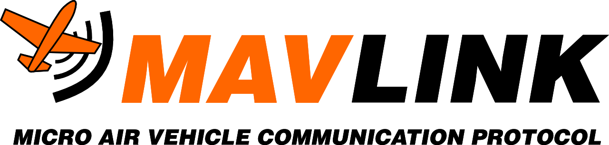

# MAVLink

[Основная документация:](https://mavlink.io/en/)

MAVLink – это протокол для организации связи между автономными летательными и транспортными системами (дронами, самолетами, автомобилями).

## Канал связи

* последовательное соединение (UART, USB и др.);
* UDP (Wi-Fi, Ethernet, 3G, LTE);
* TCP (Wi-Fi, Ethernet, 3G, LTE).

## Пакеты (Сообщения)

MAVLink отправляет пакеты от дрона к Ground control station (станция наземного управления) или наоборот содержащие информацию о состоянии дрона или команду для дрона.

### Разбор пакета:

Первый байт пакета (STX) представляет собой символ, который обозначает начало сообщения в протоколе MAVLink. Для версии v2.0 это 0xFD, для версии v1.0 - 0xFE, а для версии v0.9 - 0x55.

LEN — длинна полезной нагрузки (сообщения).

??? info "Полезная нагрузка"
    Полезная нагрузка - это часть данных в пакете передаваемой информации, которая содержит фактическую и полезную для получателя информацию. В контексте протокола MAVLink, это разнообразная информация, такая как данные о полете, измерения сенсоров, команды управления или другие данные, необходимые для функционирования и взаимодействия между автономными системами и беспилотными летательными аппаратами. Эта часть данных передается между системами и интерпретируется получателем согласно структуре и типу сообщения.

SEQ — содержит счётчик пакета (0-255), который поможет нам выявить потерю сообщения.

??? info "счетчик пакета"
    счетчик пакета, который увеличивается от 0 до 255 для каждого передаваемого пакета данных. Этот счетчик помогает системам определить потерю сообщений или ошибки в последовательности при передаче данных. Получатель использует значение SEQ для проверки прихода пакетов в правильной последовательности. Если какие-то пакеты пропущены или приходят не в правильной последовательности, получатель может определить потерю данных и принять соответствующие меры для восстановления целостности информации.

SYS (System ID) — идентификатор отправляющий системы

??? info "sys"
    Поле "SYS" (System ID) в протоколе MAVLink представляет собой идентификатор отправляющей системы. Это числовой параметр, который указывает на конкретную автономную систему, идентифицирующую себя в сети. Каждая система имеет свой уникальный SYS ID, что позволяет различать отправителей и получателей данных в сети, обмен информацией между ними и выполнение соответствующих команд или действий на основе идентификации отправителя.